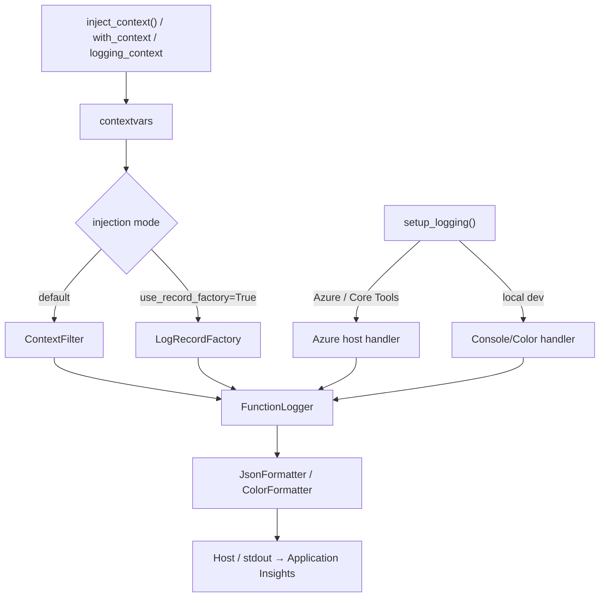

# Azure Functions Logging

> **Azure Functions Python DX Toolkit** の一部 — [azure-functions-cookbook-python](https://github.com/yeongseon/azure-functions-cookbook-python) によりドッグフーディング検証済み。

[](https://pypi.org/project/azure-functions-logging/)
[](https://pepy.tech/project/azure-functions-logging)
[](https://pypi.org/project/azure-functions-logging/)
[](https://github.com/yeongseon/azure-functions-logging-python/actions/workflows/ci-test.yml)
[](https://github.com/yeongseon/azure-functions-logging-python/actions/workflows/publish-pypi.yml)
[](https://github.com/yeongseon/azure-functions-logging-python/actions/workflows/security.yml)
[](https://codecov.io/gh/yeongseon/azure-functions-logging-python)
[](https://pre-commit.com/)
[](https://yeongseon.github.io/azure-functions-logging-python/)
[](LICENSE)

他の言語で読む: [English](README.md) | [한국어](README.ko.md) | [简体中文](README.zh-CN.md)

> ℹ️ この翻訳はコミュニティによる参考用であり、最新の [English README](README.md) より古い場合があります。正確な最新情報は英語版を参照してください。

**Azure Functions Python v2 のための、呼び出し（invocation）認識可能なオブザーバビリティ。**
`invocation_id` を表面化し、コールドスタートを検出し、`host.json` の設定不備を警告し、Application Insights にすぐに使える構造化ログを出力します — Python 標準の `logging` を置き換えることなく。

---

**Azure Functions Python DX Toolkit** の一部
→ FastAPI のような開発体験を Azure Functions にもたらします。

## なぜ存在するのか

Azure Functions Python のロギングには、汎用的なロギングライブラリでは扱えない固有の失敗モードがあります:

| 問題 | 何が起こるか | このライブラリ |
|------|-------------|---------------|
| `host.json` のログレベル衝突 | `INFO` ログが Azure で静かに消える | 起動時に検出して警告 |
| ログに `invocation_id` がない | 特定の実行とログを関連付けられない | `context` オブジェクトから自動注入 |
| コールドスタートが見えない | 新しい worker インスタンス起動時にシグナルなし | 最初の `inject_context()` で自動検出 |
| サードパーティロガーがうるさい | `azure-core`, `urllib3` が Application Insights を埋め尽くす | `SamplingFilter` / `RedactionFilter` |
| ローカルとクラウドの出力不一致 | 色付き出力が本番パイプラインを壊す | 環境認識フォーマッタ自動切替 |
| PII がログに漏洩 | extra フィールド経由で機密値が誤って記録される | キーベースの redaction を行う `RedactionFilter` |
| ログが呼び出しトレースから分離される | Python は OpenTelemetry 呼び出しミドルウェアを内蔵しない唯一の Functions worker ランタイムのため、ハンドラごとに自分で span をアクティベートしない限り worker のログレコードは `span_id=0` で分離される | host の W3C trace context をバインドし、OpenTelemetry ログが呼び出しの `trace_id` / `span_id` を継承する |

## 何をするのか

- **呼び出しコンテキスト** — すべてのログに `invocation_id`, `function_name`, `cold_start`, `host_instance_id`（スケールアウトされたワーカーインスタンス）を自動注入
- **構造化 JSON 出力** — Application Insights にそのまま使える NDJSON フォーマット
- **ノイズ制御** — `SamplingFilter` がうるさいサードパーティロガーをレート制限
- **PII 保護** — `RedactionFilter` が機密フィールドをログ集約に到達する前にマスキング

> **スコープ免責事項。** このパッケージは Python `logging` / stdout に構造化 JSON を書き込みます。これらのフィールドが Application Insights にどう現れるかは、Azure Functions host、worker、ロギング設定、および ingestion パイプラインに依存します。ライブラリは ingestion やスキーマ マッピングを所有しません — `customDimensions` にパースされる形式と、生の `message` 内に残る形式の両方が本番環境で有効です。

## OpenTelemetry トレース相関付け

> **Python は OpenTelemetry 呼び出しミドルウェアを内蔵しない唯一の Azure Functions worker ランタイムです。** host はすべての呼び出しに W3C `traceparent` を発行しますが、Python worker はそれをプロセス内でアクティベートしません — そのため自分で span をアクティベートしない限り、worker のログレコードは `span_id=0` でスタンプされ、host の呼び出し span から分離されます。

このギャップは手作業で埋めることは *できます* が、手間がかかり忘れやすいものです。structlog、Loguru、stdlib `logging` はいずれも OpenTelemetry の `LoggingHandler` / `LoggingInstrumentor` に依存し、これらはプロセス内に **アクティブな span がある場合にのみ** `trace_id` / `span_id` を付与します。Python worker はそれをアクティベートしないため、Microsoft が文書化しているパターンは host の `traceparent` を抽出し **すべてのハンドラで** 自分で span を開始することです。1つの経路でも忘れると、それらのレコードは静かに `span_id=0` にフォールバックします。

`azure-functions-logging` はそのギャップを埋めます。`activate_trace_context=True`（`[otel]` extra が必要）でオプトインすると、ライブラリがハンドラ実行中に host の W3C trace context をバインドし、既存の OpenTelemetry ログレコードが呼び出しの `trace_id` / `span_id` を継承します:

```python
from azure_functions_logging import logging_context, setup_logging

setup_logging(activate_trace_context=True)  # 必要: pip install azure-functions-logging[otel]

with logging_context(context):
    logger.info("processing")  # OpenTelemetry レコードが呼び出しの trace_id / span_id を継承
```

これは **相関付けであってトレーシングではありません** — ライブラリは span を生成・記録・エクスポートしません。OpenTelemetry や Application Insights SDK を置き換えるのではなく補完し、span の生成は引き続きそれらの責任です。[OpenTelemetry トレース相関付けガイド](https://yeongseon.github.io/azure-functions-logging-python/opentelemetry/)を参照してください。

呼び出しごとのアクティベーションを好みますか？ プロセス全体のデフォルトをスキップして直接渡します: `with logging_context(context, activate_trace_context=True):`。


## パイプライン概要



> 2つの注入モードは**相互排他的**です。`use_record_factory=True` の場合は `ContextFilter` を付加しないでください。

## Before / After

`azure-functions-logging` を **使わない場合** — 単純な `print()` 出力、コンテキストなし、構造なし:

```python
import azure.functions as func

app = func.FunctionApp()


@app.route(route="orders")
def process_order(req: func.HttpRequest) -> func.HttpResponse:
    print("Processing order")        # invocation_id なし、構造なし
    print(f"Order: {req.get_json()}")  # PII 漏洩可能、ログレベルなし
    return func.HttpResponse("OK")
```

ターミナル出力:

```
Processing order
Order: {'customer': 'Alice', 'total': 99.99}
```

> Invocation ID なし。ログレベルなし。Application Insights での相関が困難。

`azure-functions-logging` を **使う場合** — 構造化され、クエリ可能、本番環境対応:

```python
import azure.functions as func

from azure_functions_logging import JsonFormatter, get_logger, logging_context, setup_logging

setup_logging(functions_formatter=JsonFormatter())
logger = get_logger(__name__)
app = func.FunctionApp()


@app.route(route="orders")
def process_order(req: func.HttpRequest, context: func.Context) -> func.HttpResponse:
    with logging_context(context):
        logger.info("Processing order", order_id="o-999")
        return func.HttpResponse("OK")
```

スタンドアロンで実行した際 (例: `python app.py`、カラーフォーマッタ) のローカルターミナル出力:

```
10:30:00 INFO     function_app  Processing order  [invocation_id=abc-123-def, function_name=process_order, cold_start=true]
```

`func start` / Azure 環境での本番出力 (`functions_formatter` が設定されているため Application Insights 用 NDJSON が適用される):

```json
{"timestamp": "2024-01-15T10:30:00+00:00", "level": "INFO", "logger": "function_app",
 "message": "Processing order", "invocation_id": "abc-123-def",
 "function_name": "process_order", "trace_id": null, "cold_start": true,
 "host_instance_id": "0d1f2a3b4c5d",
 "exception": null, "extra": {"order_id": "o-999"}}
```

> すべてのログに `invocation_id` と `cold_start` が含まれます。Application Insights でクエリ可能。`print()` 文ゼロ。

> **注:** 正確な Application Insights スキーマは ingestion パイプラインに依存します。一部の配置では JSON フィールドが `customDimensions` にパースされ、他の配置では JSON が `message` カラム内に残ります。両方の形式の例を以下に示します。

### Application Insights でのクエリ

#### JSON フィールドが `customDimensions` にパースされる場合

```kql
traces
| where customDimensions.invocation_id == "abc-123-def"
| project timestamp, message, customDimensions.cold_start, customDimensions.function_name
| order by timestamp asc
```

過去 1 時間のすべてのコールドスタートを検索:

```kql
traces
| where customDimensions.cold_start == "true"
| where timestamp > ago(1h)
| summarize count() by bin(timestamp, 5m)
```

#### JSON が `message` カラムに残る場合

```kql
traces
| extend payload = parse_json(message)
| where tostring(payload.invocation_id) == "abc-123-def"
| project timestamp, tostring(payload.message), tostring(payload.cold_start), tostring(payload.function_name)
| order by timestamp asc
```

過去 1 時間のすべてのコールドスタートを検索:

```kql
traces
| extend payload = parse_json(message)
| where tostring(payload.cold_start) == "true"
| where timestamp > ago(1h)
| summarize count() by bin(timestamp, 5m)
```

## このパッケージがしないこと

このパッケージは以下を所有しません:

- **stdlib logging の置き換え** — Python 標準の `logging` をラップして強化するだけで、決して置き換えません
- **分散トレーシング** — Azure Functions ホストの W3C トレースコンテキストを**バインド**して、既存の OpenTelemetry ログレコードが呼び出し span の `trace_id` / `span_id` を継承するようにしますが、このライブラリ自身が span を作成・記録・エクスポートすることはありません — トレーシングではなく相関（correlation）です。span の生成には OpenTelemetry または Application Insights SDK を使用してください。[OpenTelemetry トレース相関](https://yeongseon.github.io/azure-functions-logging-python/opentelemetry/) を参照
- **API ドキュメント** — API ドキュメントと spec 生成には [`azure-functions-openapi`](https://github.com/yeongseon/azure-functions-openapi-python) を使用してください

## インストール

```bash
pip install azure-functions-logging
```

## Quick Start

```python
import azure.functions as func
from azure_functions_logging import get_logger, logging_context, setup_logging

setup_logging()
logger = get_logger(__name__)

app = func.FunctionApp()

@app.route(route="hello")
def hello(req: func.HttpRequest, context: func.Context) -> func.HttpResponse:
    with logging_context(context):  # invocation_id, function_name, cold_start をバインドし、終了時に以前のコンテキストへ復元
        logger.info("Request received")
        # ログレコードに invocation_id, function_name, cold_start が付与されます

        return func.HttpResponse("OK")
```

`logging_context` は推奨される主要パターンです。エンター時にコンテキストを注入し、（ハンドラが例外を発生させても）終了時に **常に** 前のコンテキストを復元するため、再利用された worker で古いコンテキストが次の呼び出しに漏れることを防ぎます。

低レベル制御またはカスタムミドルウェアと統合する場合は、トークンベース復元を使用してください:

```python
from azure_functions_logging import inject_context, restore_context

# `logger` と `context` がスコープにあると仮定 (Quick Start を参照)。
tokens = inject_context(context)
try:
    logger.info("Request received")
finally:
    restore_context(tokens)
```

`reset_context()` は意図的にすべてのコンテキストをクリアしたい場合 (例: テストの teardown) のみ使用してください。

ローカルで Functions host を起動 ([e2e サンプルアプリ](examples/e2e_app) 使用):

```bash
func start --script-root examples/e2e_app
```

### ローカルおよび Azure での検証

デプロイ後 ([docs/deployment.md](docs/deployment.md) 参照)、同じリクエストは両環境で同じレスポンスを生成します。

#### ローカル

```bash
curl -s http://localhost:7071/api/logme?correlation_id=demo-123
```

```json
{"logged": true, "correlation_id": "demo-123"}
```

#### Azure

```bash
curl -s "https://<your-app>.azurewebsites.net/api/logme?correlation_id=demo-123"
```

```json
{"logged": true, "correlation_id": "demo-123"}
```

> koreacentral リージョンの一時的な Azure Functions デプロイで検証 (Python 3.12, Consumption plan)。レスポンスをキャプチャし、URL は匿名化されています。

## 主要機能

以下の各機能には [ドキュメントサイト](https://yeongseon.github.io/azure-functions-logging-python/) に完全なガイドがあります。このセクションは各機能が何をするかを要約して単一の情報源にリンクし、README がドキュメントのコピーではなく簡潔な概要として保たれるようにします。

### 呼び出しコンテキスト

`logging_context(context)`（[Quick Start](#quick-start) 参照）はハンドラの実行期間中 `invocation_id`、`function_name`、`trace_id`、`cold_start` をバインドし、終了時には常に以前のコンテキストを復元します。より低レベルな制御が必要な場合は `inject_context()` / `restore_context()` を、暗黙的に注入するには `@with_context` デコレータ（同期/非同期ハンドラの両方をサポート）を使用します。

> **`cold_start` の意味。** `cold_start=True` はモジュールロード後にこの Python ワーカープロセスが初めて観測した呼び出しを意味します。プラットフォームレベルのコールドスタート指標では **ありません**。

> **ワーカーインスタンス。** すべてのレコードには、ログを生成したワーカーインスタンスを示すベストエフォートの識別子 `host_instance_id` も含まれます（`WEBSITE_INSTANCE_ID` → `WEBSITE_POD_NAME` → `CONTAINER_NAME` → `socket.gethostname()` の順で解決）。これは Application Insights の `cloud_RoleInstance` を補完しますが、常に一致することは保証されません。

→ [使い方: コンテキスト注入](https://yeongseon.github.io/azure-functions-logging-python/usage/#3-context-injection-in-azure-functions) · [API: `with_context`](https://yeongseon.github.io/azure-functions-logging-python/api/#with_context)

### 構造化 JSON 出力

`setup_logging(functions_formatter=JsonFormatter())` を渡すと、ホスト管理のハンドラで Application Insights 向け NDJSON を出力します（スタンドアロン実行/CI では `format="json"`）。追加フィールドは `extra` の下に入り、`truncate_native_strings=True` で長い文字列値を切り詰められます。

→ [使い方: JSON 出力](https://yeongseon.github.io/azure-functions-logging-python/usage/#2-json-output-for-production) · [API: `JsonFormatter`](https://yeongseon.github.io/azure-functions-logging-python/api/#jsonformatter)

### host.json 衝突検出

起動時、`host.json`（または `AzureFunctionsJobHost__logging__logLevel__...` アプリ設定のオーバーライド）がアプリの発行するレベルを抑制する場合に警告します。`host.json` は作業ディレクトリ（または `AzureWebJobsScriptRoot`）から上位に探索して自動発見され、`host_json_path=` で上書きできます。

→ [設定: host.json 衝突](https://yeongseon.github.io/azure-functions-logging-python/configuration/#hostjson-level-conflict-warning) · [トラブルシューティング](https://yeongseon.github.io/azure-functions-logging-python/troubleshooting/#hostjson-conflict-warning-appears)

### ノイズ制御と PII Redaction

`SamplingFilter` は冗長なサードパーティロガー（`azure-core`、`urllib3` など）のレートを制限し、`RedactionFilter` は機密キー（パスワード、トークン、シークレット、接続文字列など — 大文字小文字を区別せず、再帰的）をログ集約前にマスクします。どちらもルートハンドラにアタッチし、`sensitive_keys=[...]` でカスタマイズできます。

→ [API: `SamplingFilter`](https://yeongseon.github.io/azure-functions-logging-python/api/#samplingfilter) · [API: `RedactionFilter`](https://yeongseon.github.io/azure-functions-logging-python/api/#redactionfilter)

### コンテキストバインディング

`logger.bind(key=value)` は、以降のすべてのログにリクエストスコープのメタデータを付与するロガーを返します。呼び出しごとにバインドされたロガーを作成し、モジュールレベルでキャッシュしないでください。

→ [使い方: コンテキストバインディング](https://yeongseon.github.io/azure-functions-logging-python/usage/#4-context-binding-with-functionloggerbind)

### グローバル LogRecordFactory (オプトイン)


`setup_logging(use_record_factory=True)` はグローバルな `LogRecordFactory` をインストールし、レコード生成時にコンテキストを注入することで、ハンドラ/フィルタの構成に関係なく **すべての** `LogRecord` がコンテキストを持つようにします。`setup_logging()` 後にハンドラが追加されたり、ロガーがフィルタチェーンをバイパスする場合に便利です。デフォルトの `ContextFilter` モードとは相互排他的です。

→ [設定: `use_record_factory`](https://yeongseon.github.io/azure-functions-logging-python/configuration/#parameter-use_record_factory)

### ローカル vs クラウド

`setup_logging()` は `FUNCTIONS_WORKER_RUNTIME` を検出します：ローカルでは色付きの人間が読みやすい出力、Azure / Core Tools ではホスト管理の NDJSON（コンテキストフィルタのみ — ハンドラ重複なし）、CI では機械可読な JSON。

→ [設定: 環境検出](https://yeongseon.github.io/azure-functions-logging-python/configuration/#environment-detection)

## いつ使うか

- Application Insights で構造化されクエリ可能なログが必要なとき
- 単一リクエストのすべてのログにわたる `invocation_id` 相関が必要なとき
- カスタム instrumentation なしでコールドスタート検出が必要なとき
- サードパーティロガーに対して PII redaction やノイズ制御が必要なとき
- `host.json` 設定が静かにログを抑制し、その理由がわからないとき

## ドキュメント

- 完全なドキュメント: [yeongseon.github.io/azure-functions-logging-python](https://yeongseon.github.io/azure-functions-logging-python/)
- [Configuration reference](https://yeongseon.github.io/azure-functions-logging-python/configuration/)
- [Troubleshooting guide](https://yeongseon.github.io/azure-functions-logging-python/troubleshooting/)
- [API reference](https://yeongseon.github.io/azure-functions-logging-python/api/)

## エコシステム

このパッケージは **Azure Functions Python DX Toolkit** の一部です。

**設計原則:** `azure-functions-logging` は構造化ロギングと呼び出し認識オブザーバビリティを所有します。Python 標準の `logging` を強化します — 置き換えません。隣接する関心事は [`azure-functions-openapi`](https://github.com/yeongseon/azure-functions-openapi-python) (API ドキュメントと spec 生成)、[`azure-functions-validation`](https://github.com/yeongseon/azure-functions-validation-python) (リクエスト/レスポンス検証とシリアライゼーション)、[`azure-functions-langgraph`](https://github.com/yeongseon/azure-functions-langgraph-python) (LangGraph ランタイム公開) に属します。

| パッケージ | 役割 |
|----------|------|
| [azure-functions-openapi-python](https://github.com/yeongseon/azure-functions-openapi-python) | OpenAPI spec 生成と Swagger UI |
| [azure-functions-validation-python](https://github.com/yeongseon/azure-functions-validation-python) | リクエスト/レスポンス検証とシリアライゼーション |
| [azure-functions-db-python](https://github.com/yeongseon/azure-functions-db-python) | SQLAlchemy ベースの DB 統合ヘルパー（ポーリングベースの擬似トリガー、入力/出力/クライアント注入） |
| [azure-functions-langgraph-python](https://github.com/yeongseon/azure-functions-langgraph-python) | Azure Functions 向け LangGraph デプロイアダプタ |
| [azure-functions-scaffold-python](https://github.com/yeongseon/azure-functions-scaffold-python) | プロジェクトスキャフォールディング CLI |
| **azure-functions-logging-python** | 構造化ロギングとオブザーバビリティ |
| [azure-functions-doctor-python](https://github.com/yeongseon/azure-functions-doctor-python) | デプロイ前診断 CLI |
| [azure-functions-durable-graph-python](https://github.com/yeongseon/azure-functions-durable-graph-python) | Durable Functions ベースのマニフェストファーストグラフランタイム *(experimental)* |
| [azure-functions-knowledge-python](https://github.com/yeongseon/azure-functions-knowledge-python) | 知識検索 (RAG) デコレータ |
| [azure-functions-cookbook-python](https://github.com/yeongseon/azure-functions-cookbook-python) | ドッグフード例 — toolkit 全体を実行する実行可能なレシピ |


## AI コーディングアシスタント向け

このパッケージは stdlib logging に変更を加えずに Azure Functions に構造化ロギングを提供します。

**LLM フレンドリーなリソース:**
- `llms.txt` — 簡潔な API リファレンスと quick start (リポジトリルート)
- `llms-full.txt` — 完全な API シグネチャ、パターン、設計原則 (リポジトリルート)

**コード生成のための主要な実装詳細:**

1. **ホスト構成を尊重** — Azure / Core Tools ではハンドラを追加せず、ルートロガーのレベルは `host.json` に委ねます。既存のルートハンドラとルートロガー自身に `ContextFilter` をインストールします（ルートロガーでの直接呼び出しはコンテキストを仲介する）。名前付きの子ロガーから伝搬されて後から追加されたハンドラへ到達するレコードにもコンテキストを保証したい場合は `setup_logging()` に `use_record_factory=True` を渡してください。ローカル単独モードでは `setup_logging(logger_name=None)` がルートロガーを構成します（レベル設定、ハンドラがなければ `StreamHandler` 追加）。
2. **コンテキスト注入は contextvar ベース** — thread-local ではなく、asyncio で動作
3. **冪等な setup** — `setup_logging()` を複数回呼び出しても安全
4. **2 つの環境、2 つの動作**:
   - Azure/Core Tools: 既存の root ハンドラと root ロガー自身に `ContextFilter` をインストールします。ハンドラの追加や root レベルの変更は行いません (`host.json` を尊重)。
   - スタンドアロンのローカル実行: 対象/ルートロガーのレベルを設定します。**ハンドラが 1 つも存在しない場合に限り** `StreamHandler` (ColorFormatter または JsonFormatter) を追加し、そうでなければ既存のハンドラにフィルタのみ付加します。
5. **テストフレンドリー**:
   - `inject_context()` は任意のオブジェクトを受け入れる (azure.functions.Context への強い依存なし)
   - `with_context` デコレータは同期および非同期ハンドラで動作
   - 必要に応じてテスト teardown で `reset_context()` を使用

**コード生成時:**
- `azure_functions_logging` の公開 API からのみインポート (アンダースコアなし)
- `setup_logging()` をモジュールレベルまたはハンドラ起動時に呼び出す (リクエストごとではない)
- ハンドラでは `with logging_context(context):` を優先; 生の `inject_context(context)` は `try/finally restore_context(tokens)` とのみ併用
- リクエストごとのフィールドには `logger.bind(key=value)` を使用 (logger.extra への直接アクセスではない)
- 暗黙的なハンドラごとのコンテキスト注入を好む場合は `with_context` デコレータを使用
- 関数の `@with_context` メタデータを検査するには `get_logging_metadata(func)` を呼び出す (`dict[str, Any] | None` を返却)
- PII フィールドには `RedactionFilter`、大量ログには `SamplingFilter` を適用

**例パターン:**
```python
from azure_functions_logging import get_logger, logging_context, setup_logging

# モジュールレベル
setup_logging()
logger = get_logger(__name__)

# ハンドラごと
def my_function(req: func.HttpRequest, context: func.Context) -> func.HttpResponse:
    with logging_context(context):
        req_logger = logger.bind(correlation_id=req.params.get("id"))
        req_logger.info("Processing")
        return func.HttpResponse("OK")
```


このプロジェクトは独立したコミュニティプロジェクトであり、Microsoft と提携、承認、保守関係にはありません。

Azure および Azure Functions は Microsoft Corporation の商標です。

## ライセンス

MIT
