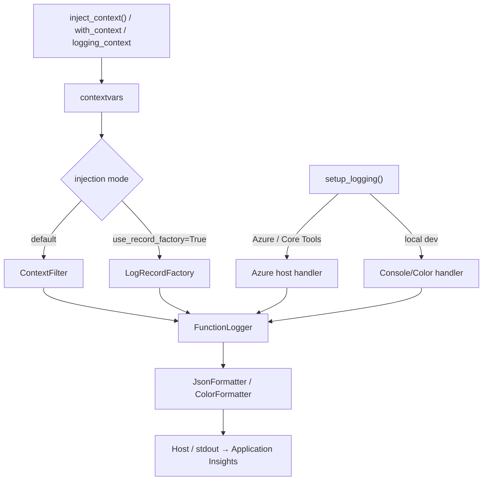

# Azure Functions Logging

> **Azure Functions Python DX Toolkit**의 일부 — [azure-functions-cookbook-python](https://github.com/yeongseon/azure-functions-cookbook-python)에서 도그푸딩(dogfooding)으로 검증되었습니다.

[](https://pypi.org/project/azure-functions-logging/)
[](https://pepy.tech/project/azure-functions-logging)
[](https://pypi.org/project/azure-functions-logging/)
[](https://github.com/yeongseon/azure-functions-logging-python/actions/workflows/ci-test.yml)
[](https://github.com/yeongseon/azure-functions-logging-python/actions/workflows/publish-pypi.yml)
[](https://github.com/yeongseon/azure-functions-logging-python/actions/workflows/security.yml)
[](https://codecov.io/gh/yeongseon/azure-functions-logging-python)
[](https://pre-commit.com/)
[](https://yeongseon.github.io/azure-functions-logging-python/)
[](LICENSE)

다른 언어로 보기: [English](README.md) | [日本語](README.ja.md) | [简体中文](README.zh-CN.md)

**Azure Functions Python v2를 위한 호출(invocation) 인지 가능한 관측성(observability).**
`invocation_id`를 노출하고, cold start를 감지하며, `host.json` 설정 오류를 경고하고, Application Insights에 바로 사용 가능한 구조화된 로그를 출력합니다 — Python 표준 `logging`을 대체하지 않습니다.

---

**Azure Functions Python DX Toolkit**의 일부
→ FastAPI와 같은 개발자 경험을 Azure Functions에 제공합니다.

## 왜 필요한가

Azure Functions Python의 logging에는 일반 logging 라이브러리가 다루지 않는 고유의 실패 모드가 있습니다:

| 문제 | 발생 현상 | 이 라이브러리의 해결책 |
|------|-----------|------------------------|
| `host.json` 로그 레벨 충돌 | `INFO` 로그가 Azure에서 조용히 사라짐 | 시작 시점에 감지하여 경고 |
| 로그에 `invocation_id` 부재 | 특정 실행과 로그를 연결할 수 없음 | `context` 객체에서 자동 주입 |
| Cold start가 보이지 않음 | 새 worker 인스턴스 시작 시 신호 없음 | 첫 `inject_context()` 호출 시 자동 감지 |
| 시끄러운 서드파티 로거 | `azure-core`, `urllib3` 등이 Application Insights를 채움 | `SamplingFilter` / `RedactionFilter` |
| 로컬과 클라우드 출력 불일치 | 색상 출력이 프로덕션 파이프라인을 깨뜨림 | 환경 인지 포매터 자동 전환 |
| PII가 로그에 유출 | extra 필드를 통해 민감 값이 우발적으로 기록 | 키 기반 redaction을 수행하는 `RedactionFilter` |
| 로그가 호출 트레이스에서 분리됨 | Python은 OpenTelemetry 호출 미들웨어가 내장되지 않은 유일한 Functions worker 런타임이라, 핸들러마다 직접 span을 활성화하지 않으면 worker 로그 레코드가 `span_id=0`으로 분리됨 | host의 W3C trace context를 바인딩해 OpenTelemetry 로그가 호출의 `trace_id` / `span_id`를 상속하도록 함 |

## 무엇을 하는가

- **호출 컨텍스트** — 모든 로그에 `invocation_id`, `function_name`, `cold_start`를 자동 주입
- **구조화된 JSON 출력** — Application Insights에 바로 적합한 NDJSON 포맷
- **노이즈 제어** — `SamplingFilter`로 시끄러운 서드파티 로거의 비율을 제한
- **PII 보호** — `RedactionFilter`로 민감 필드를 로그 집계에 도달하기 전에 마스킹

> **범위 면책.** 이 패키지는 Python `logging` / stdout으로 구조화된 JSON을 씁니다. Application Insights에서 어떻게 표시되는지는 Azure Functions host, worker, logging 구성, ingestion 파이프라인에 따라 달라집니다. 라이브러리는 ingestion이나 schema mapping을 책임지지 않습니다 — `customDimensions`로 파싱되는 형태와 raw `message`에 들어가는 형태 모두 프로덕션에서 유효합니다.

## OpenTelemetry 트레이스 상관관계

> **Python은 OpenTelemetry 호출 미들웨어가 내장되지 않은 유일한 Azure Functions worker 런타임입니다.** host는 모든 호출에 대해 W3C `traceparent`를 발행하지만 Python worker는 이를 프로세스 안에서 활성화하지 않습니다 — 그래서 span을 직접 활성화하지 않는 한 worker 로그 레코드는 `span_id=0`으로 기록되고 host의 호출 span에서 분리됩니다.

직접 메꿀 수는 있지만, 수작업이고 까먹기 쉽습니다. structlog, Loguru, stdlib `logging`은 `trace_id` / `span_id`를 붙이기 위해 OpenTelemetry의 `LoggingHandler` / `LoggingInstrumentor`에 의존하지만, 이들은 프로세스에 **활성 span이 있을 때만** 동작합니다. Python worker는 span을 활성화하지 않기 때문에, Microsoft가 문서화한 패턴은 host의 `traceparent`를 추출해 **모든 핸들러에서** 직접 span을 시작하는 것입니다. 한 경로라도 놓치면 해당 레코드는 조용히 `span_id=0`으로 돌아갑니다.

`azure-functions-logging`은 그 간극을 메웁니다. `activate_trace_context=True`(`[otel]` extra 필요)로 옵트인하면 라이브러리가 핸들러 실행 동안 host의 W3C trace context를 바인딩하여, 기존 OpenTelemetry 로그 레코드가 호출의 `trace_id` / `span_id`를 상속하게 합니다:

```python
from azure_functions_logging import logging_context, setup_logging

setup_logging(activate_trace_context=True)  # 필요: pip install azure-functions-logging[otel]

with logging_context(context):
    logger.info("processing")  # OpenTelemetry 레코드가 호출의 trace_id / span_id를 상속
```

이는 **상관관계이지 트레이싱이 아닙니다** — 라이브러리는 결코 span을 생성, 기록, 내보내지 않습니다. OpenTelemetry나 Application Insights SDK를 대체하지 않고 보완하며, span 생성은 여전히 그들의 책임입니다. [OpenTelemetry 트레이스 상관관계 가이드](https://yeongseon.github.io/azure-functions-logging-python/opentelemetry/)를 참고하세요.

호출단위 활성화를 선호하시나요? 프로세스 전역 기본값 대신 인자로 직접 전달하세요: `with logging_context(context, activate_trace_context=True):`.


## 파이프라인 개요



> 두 주입 모드는 **상호 배타적**입니다. `use_record_factory=True`일 때는 `ContextFilter`를 추가하지 마세요.

## Before / After

`azure-functions-logging` **사용 전** — 단순 `print()` 출력, 컨텍스트 없음, 구조 없음:

```python
import azure.functions as func

app = func.FunctionApp()


@app.route(route="orders")
def process_order(req: func.HttpRequest) -> func.HttpResponse:
    print("Processing order")        # invocation_id 없음, 구조 없음
    print(f"Order: {req.get_json()}")  # PII 유출 가능, 로그 레벨 없음
    return func.HttpResponse("OK")
```

터미널 출력:

```
Processing order
Order: {'customer': 'Alice', 'total': 99.99}
```

> Invocation ID 없음. 로그 레벨 없음. Application Insights에서 상관(correlate)하기 어려움.

`azure-functions-logging` **사용 후** — 구조화되고, 쿼리 가능하며, 프로덕션 준비 완료:

```python
import azure.functions as func

from azure_functions_logging import JsonFormatter, get_logger, logging_context, setup_logging

setup_logging(functions_formatter=JsonFormatter())
logger = get_logger(__name__)
app = func.FunctionApp()


@app.route(route="orders")
def process_order(req: func.HttpRequest, context: func.Context) -> func.HttpResponse:
    with logging_context(context):
        logger.info("Processing order", order_id="o-999")
        return func.HttpResponse("OK")
```

단독 실행할 때 (예: `python app.py`, 컬러 포맷터) 로컬 터미널 출력:

```
10:30:00 INFO     function_app  Processing order  [invocation_id=abc-123-def, function_name=process_order, cold_start=true]
```

`func start` / Azure 환경에서의 프로덕션 출력 (`functions_formatter`가 설정되어 있으므로 Application Insights용 NDJSON이 적용됨):

```json
{"timestamp": "2024-01-15T10:30:00+00:00", "level": "INFO", "logger": "function_app",
 "message": "Processing order", "invocation_id": "abc-123-def",
 "function_name": "process_order", "trace_id": null, "cold_start": true,
 "exception": null, "extra": {"order_id": "o-999"}}
```

> 모든 로그에 `invocation_id`와 `cold_start`가 포함됩니다. Application Insights에서 쿼리 가능. `print()` 문 없음.

> **참고:** 정확한 Application Insights 스키마는 ingestion 파이프라인에 따라 다릅니다. 일부 배포에서는 JSON 필드가 `customDimensions`로 파싱되고, 다른 곳에서는 JSON이 `message` 컬럼 내부에 그대로 남습니다. 두 형태 모두에 대한 예시가 아래에 있습니다.

### Application Insights에서 쿼리

#### JSON 필드가 `customDimensions`로 파싱되는 경우

```kql
traces
| where customDimensions.invocation_id == "abc-123-def"
| project timestamp, message, customDimensions.cold_start, customDimensions.function_name
| order by timestamp asc
```

지난 1시간의 모든 cold start 찾기:

```kql
traces
| where customDimensions.cold_start == "true"
| where timestamp > ago(1h)
| summarize count() by bin(timestamp, 5m)
```

#### JSON이 `message` 컬럼에 그대로 남는 경우

```kql
traces
| extend payload = parse_json(message)
| where tostring(payload.invocation_id) == "abc-123-def"
| project timestamp, tostring(payload.message), tostring(payload.cold_start), tostring(payload.function_name)
| order by timestamp asc
```

지난 1시간의 모든 cold start 찾기:

```kql
traces
| extend payload = parse_json(message)
| where tostring(payload.cold_start) == "true"
| where timestamp > ago(1h)
| summarize count() by bin(timestamp, 5m)
```

## 이 패키지가 하지 않는 일

이 패키지는 다음을 책임지지 않습니다:

- **stdlib logging 대체** — Python 표준 `logging`을 감싸고 보강할 뿐, 절대 대체하지 않습니다
- **분산 트레이싱** — Azure Functions 호스트의 W3C trace context를 **바인딩**하여 기존 OpenTelemetry 로그 레코드가 호출 span의 `trace_id` / `span_id`를 상속하도록 하지만, 이 라이브러리가 직접 span을 생성·기록·내보내지는 않습니다 — 트레이싱이 아니라 상관(correlation)입니다. span 생성에는 OpenTelemetry나 Application Insights SDK를 사용하세요. [OpenTelemetry trace 상관](https://yeongseon.github.io/azure-functions-logging-python/opentelemetry/) 참고
- **API 문서** — API 문서 및 spec 생성에는 [`azure-functions-openapi`](https://github.com/yeongseon/azure-functions-openapi-python)를 사용하세요

## 설치

```bash
pip install azure-functions-logging
```

## Quick Start

```python
import azure.functions as func
from azure_functions_logging import get_logger, logging_context, setup_logging

setup_logging()
logger = get_logger(__name__)

app = func.FunctionApp()

@app.route(route="hello")
def hello(req: func.HttpRequest, context: func.Context) -> func.HttpResponse:
    with logging_context(context):  # invocation_id, function_name, cold_start 바인딩, 종료 시 이전 컨텍스트로 복원
        logger.info("Request received")
        # 로그 레코드에 invocation_id, function_name, cold_start가 실립니다

        return func.HttpResponse("OK")
```

`logging_context`는 권장되는 기본 패턴입니다. 진입 시 컨텍스트를 주입하고, **항상** 종료 시 (핸들러가 예외를 발생시키더라도) 이전 컨텍스트를 복원하므로, 재사용되는 worker에서 stale 컨텍스트가 다음 호출로 누출되는 것을 방지합니다.

저수준 제어가 필요하거나 커스텀 미들웨어와 통합할 때는 토큰 기반 복원을 사용하세요:

```python
from azure_functions_logging import inject_context, restore_context

# `logger`와 `context`가 스코프에 있다고 가정 (Quick Start 참조).
tokens = inject_context(context)
try:
    logger.info("Request received")
finally:
    restore_context(tokens)
```

`reset_context()`는 의도적으로 모든 컨텍스트를 지우려는 경우(예: 테스트 teardown)에만 사용하세요.

Functions host를 로컬에서 실행 ([e2e 예제 앱](examples/e2e_app) 사용):

```bash
func start --script-root examples/e2e_app
```

### 로컬 및 Azure에서 검증

배포 후 ([docs/deployment.md](docs/deployment.md) 참고), 동일한 요청은 두 환경에서 동일한 응답을 생성합니다.

#### 로컬

```bash
curl -s http://localhost:7071/api/logme?correlation_id=demo-123
```

```json
{"logged": true, "correlation_id": "demo-123"}
```

#### Azure

```bash
curl -s "https://<your-app>.azurewebsites.net/api/logme?correlation_id=demo-123"
```

```json
{"logged": true, "correlation_id": "demo-123"}
```

> koreacentral 리전의 임시 Azure Functions 배포로 검증되었습니다 (Python 3.12, Consumption plan). 응답은 캡처되었으며 URL은 익명화되었습니다.

## 핵심 기능

아래 모든 기능은 [문서 사이트](https://yeongseon.github.io/azure-functions-logging-python/)에 전체 사용법이 있습니다. 이 섹션은 각 기능이 무엇을 하는지 요약하고 단일 출처로 링크하여, README가 문서의 사본이 아니라 빠른 개요로 유지되도록 합니다.

### 호출 컨텍스트

`logging_context(context)`([Quick Start](#quick-start) 참조)는 핸들러가 실행되는 동안 `invocation_id`, `function_name`, `trace_id`, `cold_start`를 바인딩하고, 종료 시 항상 이전 컨텍스트를 복원합니다. 더 낮은 수준의 제어가 필요하면 `inject_context()` / `restore_context()`를, 암묵적으로 주입하려면 `@with_context` 데코레이터(동기/비동기 핸들러 모두 지원)를 사용하세요.

> **`cold_start` 의미.** `cold_start=True`는 모듈 로드 이후 이 Python 워커 프로세스가 처음 관찰한 호출을 의미합니다. 플랫폼 수준의 콜드 스타트 지표가 **아닙니다**.

→ [사용법: 컨텍스트 주입](https://yeongseon.github.io/azure-functions-logging-python/usage/#3-context-injection-in-azure-functions) · [API: `with_context`](https://yeongseon.github.io/azure-functions-logging-python/api/#with_context)

### 구조화된 JSON 출력

`setup_logging(functions_formatter=JsonFormatter())`를 전달하면 호스트 관리 핸들러에서 Application Insights용 NDJSON을 출력합니다(독립 실행/CI에서는 `format="json"`). 추가 필드는 `extra` 아래에 들어가며, `truncate_native_strings=True`로 긴 문자열 값을 자를 수 있습니다.

→ [사용법: JSON 출력](https://yeongseon.github.io/azure-functions-logging-python/usage/#2-json-output-for-production) · [API: `JsonFormatter`](https://yeongseon.github.io/azure-functions-logging-python/api/#jsonformatter)

### host.json 충돌 감지

시작 시 `host.json`(또는 `AzureFunctionsJobHost__logging__logLevel__...` 앱 설정 오버라이드)이 앱이 방출하는 레벨을 억제하면 경고합니다. `host.json`은 작업 디렉터리(또는 `AzureWebJobsScriptRoot`)에서 상위로 탐색하여 자동 발견되며, `host_json_path=`로 재정의할 수 있습니다.

→ [구성: host.json 충돌](https://yeongseon.github.io/azure-functions-logging-python/configuration/#hostjson-level-conflict-warning) · [문제 해결](https://yeongseon.github.io/azure-functions-logging-python/troubleshooting/#hostjson-conflict-warning-appears)

### 노이즈 제어 및 PII Redaction

`SamplingFilter`는 시끄러운 서드파티 로거(`azure-core`, `urllib3` 등)의 속도를 제한하고, `RedactionFilter`는 민감한 키(비밀번호, 토큰, 시크릿, 연결 문자열 등 — 대소문자 무시, 재귀적)를 로그 집계 전에 마스킹합니다. 둘 다 루트 핸들러에 연결하며, `sensitive_keys=[...]`로 사용자 지정할 수 있습니다.

→ [API: `SamplingFilter`](https://yeongseon.github.io/azure-functions-logging-python/api/#samplingfilter) · [API: `RedactionFilter`](https://yeongseon.github.io/azure-functions-logging-python/api/#redactionfilter)

### 컨텍스트 바인딩

`logger.bind(key=value)`는 이후 모든 로그에 요청 범위 메타데이터를 첨부하는 로거를 반환합니다. 호출당 바운드 로거를 생성하고 모듈 레벨에서 캐싱하지 마세요.

→ [사용법: 컨텍스트 바인딩](https://yeongseon.github.io/azure-functions-logging-python/usage/#4-context-binding-with-functionloggerbind)

### 글로벌 LogRecordFactory (opt-in)


`setup_logging(use_record_factory=True)`는 전역 `LogRecordFactory`를 설치하여 레코드 생성 시점에 컨텍스트를 주입하므로, 핸들러/필터 구성과 무관하게 **모든** `LogRecord`가 컨텍스트를 갖도록 합니다. `setup_logging()` 이후 핸들러가 추가되거나 로거가 필터 체인을 우회할 때 유용합니다. 기본 `ContextFilter` 모드와는 상호 배타적입니다.

→ [구성: `use_record_factory`](https://yeongseon.github.io/azure-functions-logging-python/configuration/#parameter-use_record_factory)

### 로컬 vs 클라우드

`setup_logging()`은 `FUNCTIONS_WORKER_RUNTIME`을 감지합니다: 로컬에서는 색상이 있는 사람이 읽기 쉬운 출력, Azure / Core Tools에서는 호스트 관리 NDJSON(컨텍스트 필터만 — 핸들러 중복 없음), CI에서는 기계가 파싱 가능한 JSON.

→ [구성: 환경 감지](https://yeongseon.github.io/azure-functions-logging-python/configuration/#environment-detection)

## 언제 사용하는가

- Application Insights에서 구조화되고 쿼리 가능한 로그가 필요할 때
- 한 요청의 모든 로그에 대해 `invocation_id` 상관관계를 원할 때
- 커스텀 instrumentation 없이 cold start 감지가 필요할 때
- 서드파티 로거에 대해 PII redaction이나 노이즈 제어를 원할 때
- `host.json` 구성이 조용히 로그를 억제하는데 이유를 모를 때

## 문서

- 전체 문서: [yeongseon.github.io/azure-functions-logging-python](https://yeongseon.github.io/azure-functions-logging-python/)
- [Configuration reference](https://yeongseon.github.io/azure-functions-logging-python/configuration/)
- [Troubleshooting guide](https://yeongseon.github.io/azure-functions-logging-python/troubleshooting/)
- [API reference](https://yeongseon.github.io/azure-functions-logging-python/api/)

## 생태계 (Ecosystem)

이 패키지는 **Azure Functions Python DX Toolkit**의 일부입니다.

**디자인 원칙:** `azure-functions-logging`은 구조화된 logging과 호출 인지 관측성을 책임집니다. Python의 표준 `logging`을 보강할 뿐, 대체하지 않습니다. 인접 관심사는 [`azure-functions-openapi`](https://github.com/yeongseon/azure-functions-openapi-python) (API 문서 및 spec 생성), [`azure-functions-validation`](https://github.com/yeongseon/azure-functions-validation-python) (요청/응답 검증 및 직렬화), [`azure-functions-langgraph`](https://github.com/yeongseon/azure-functions-langgraph-python) (LangGraph 런타임 노출)이 담당합니다.

| 패키지 | 역할 |
|--------|------|
| [azure-functions-openapi-python](https://github.com/yeongseon/azure-functions-openapi-python) | OpenAPI spec 생성 및 Swagger UI |
| [azure-functions-validation-python](https://github.com/yeongseon/azure-functions-validation-python) | 요청/응답 검증 및 직렬화 |
| [azure-functions-db-python](https://github.com/yeongseon/azure-functions-db-python) | SQLAlchemy 기반 DB 통합 헬퍼 (폴링 기반 의사 트리거, 입력/출력/클라이언트 주입) |
| [azure-functions-langgraph-python](https://github.com/yeongseon/azure-functions-langgraph-python) | Azure Functions용 LangGraph 배포 어댑터 |
| [azure-functions-scaffold-python](https://github.com/yeongseon/azure-functions-scaffold-python) | 프로젝트 스캐폴딩 CLI |
| **azure-functions-logging-python** | 구조화된 logging 및 관측성 |
| [azure-functions-doctor-python](https://github.com/yeongseon/azure-functions-doctor-python) | 사전 배포 진단 CLI |
| [azure-functions-durable-graph-python](https://github.com/yeongseon/azure-functions-durable-graph-python) | Durable Functions 기반 manifest-first 그래프 런타임 *(experimental)* |
| [azure-functions-knowledge-python](https://github.com/yeongseon/azure-functions-knowledge-python) | 지식 검색 (RAG) 데코레이터 |
| [azure-functions-cookbook-python](https://github.com/yeongseon/azure-functions-cookbook-python) | 도그푸딩 예제 — 전체 toolkit을 실행하는 실행 가능한 레시피 |


## AI 코딩 어시스턴트를 위한 안내

이 패키지는 stdlib logging을 수정하지 않고 Azure Functions를 위한 구조화된 logging을 제공합니다.

**LLM 친화적 리소스:**
- `llms.txt` — 간결한 API 레퍼런스와 quick start (저장소 루트)
- `llms-full.txt` — 완전한 API 시그니처, 패턴, 디자인 원칙 (저장소 루트)

**코드 생성을 위한 핵심 구현 세부사항:**

1. **호스트 구성 보존** — Azure / Core Tools에서는 핸들러를 추가하지 않고 루트 로거 레벨을 `host.json`에 위임하며, 기존 루트 핸들러와 루트 로거 자체에 `ContextFilter`를 설치합니다 (루트 로거에 직접 기록되는 레코드에도 컨텍스트가 실립니다). 이름 있는 자식 로거에서 이후 추가되는 핸들러로 전파되는 레코드까지 보장하려면 `setup_logging()`에 `use_record_factory=True`를 전달하세요. 로컬 단독 모드에서는 `setup_logging(logger_name=None)`이 루트 로거를 구성합니다 (레벨 설정, 핸들러 없으면 `StreamHandler` 추가).
2. **컨텍스트 주입은 contextvar 기반** — thread-local이 아니므로 asyncio와 호환
3. **멱등성 보장 setup** — `setup_logging()`을 여러 번 호출해도 안전
4. **두 환경, 두 동작**:
   - Azure/Core Tools: 기존 root 핸들러와 root 로거 자체에 `ContextFilter`를 설치합니다. 핸들러를 추가하거나 root 레벨을 변경하지 않습니다 (`host.json` 존중).
   - 로컬 독립 실행: 대상/루트 로거 레벨을 설정합니다. **핸들러가 하나도 없을 때만** `StreamHandler` (ColorFormatter 또는 JsonFormatter)를 추가하고, 그렇지 않으면 기존 핸들러에 필터만 부착합니다.
5. **테스트 친화적**:
   - `inject_context()`는 어떤 객체든 받음 (azure.functions.Context에 강한 의존성 없음)
   - `with_context` 데코레이터는 동기 및 비동기 핸들러에서 동작
   - 필요하다면 테스트 teardown에서 `reset_context()` 사용

**코드 생성 시:**
- `azure_functions_logging` 공개 API에서만 import (밑줄 없음)
- `setup_logging()`은 모듈 레벨이나 핸들러 시작 시 호출 (요청당 호출 X)
- 핸들러에서는 `with logging_context(context):`를 우선 사용; raw `inject_context(context)`는 반드시 `try/finally restore_context(tokens)`와 함께 사용
- 요청당 필드에는 `logger.bind(key=value)` 사용 (logger.extra 직접 X)
- 암묵적 핸들러별 컨텍스트 주입이 필요하면 `with_context` 데코레이터 사용
- 함수에 적용된 `@with_context` 메타데이터를 검사하려면 `get_logging_metadata(func)` 호출 (`dict[str, Any] | None` 반환)
- PII 필드에는 `RedactionFilter`, 대량 로그에는 `SamplingFilter` 적용

**예시 패턴:**
```python
from azure_functions_logging import get_logger, logging_context, setup_logging

# 모듈 레벨
setup_logging()
logger = get_logger(__name__)

# 핸들러별
def my_function(req: func.HttpRequest, context: func.Context) -> func.HttpResponse:
    with logging_context(context):
        req_logger = logger.bind(correlation_id=req.params.get("id"))
        req_logger.info("Processing")
        return func.HttpResponse("OK")
```


이 프로젝트는 독립적인 커뮤니티 프로젝트이며 Microsoft와 제휴, 후원, 유지보수 관계가 없습니다.

Azure 및 Azure Functions는 Microsoft Corporation의 상표입니다.

## 라이선스

MIT
