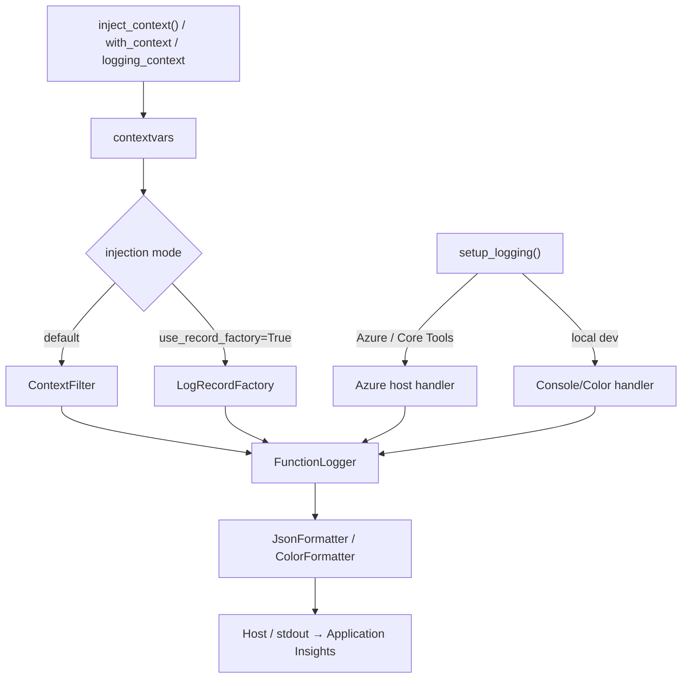
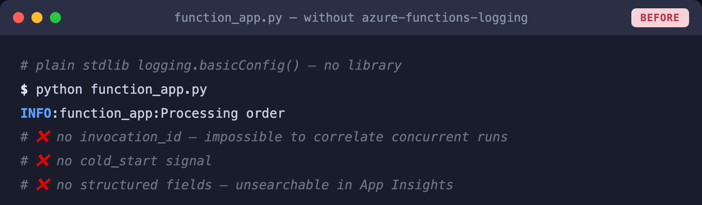
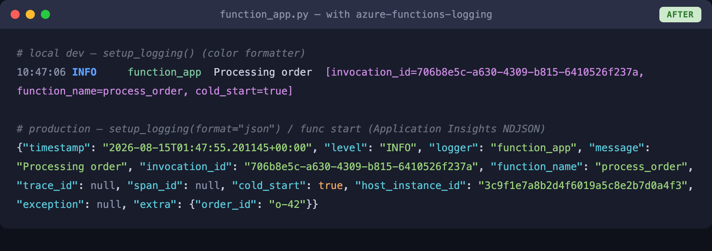
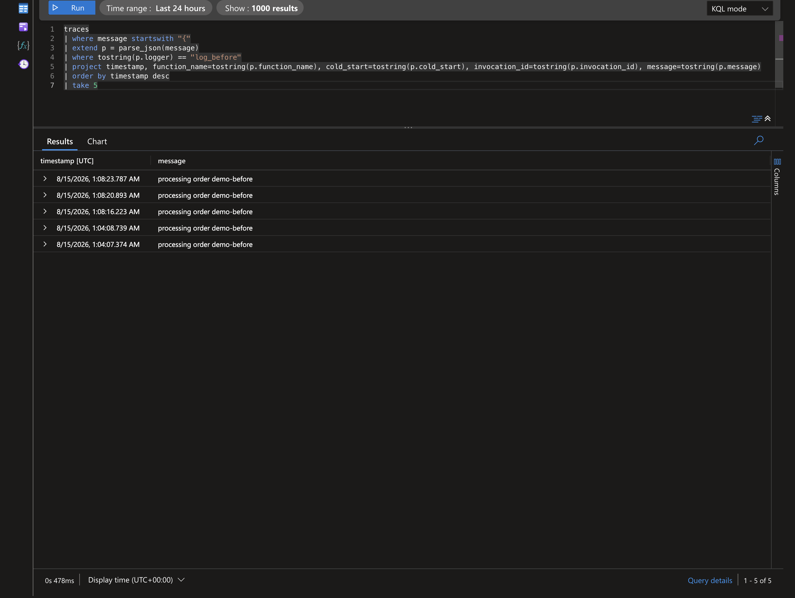
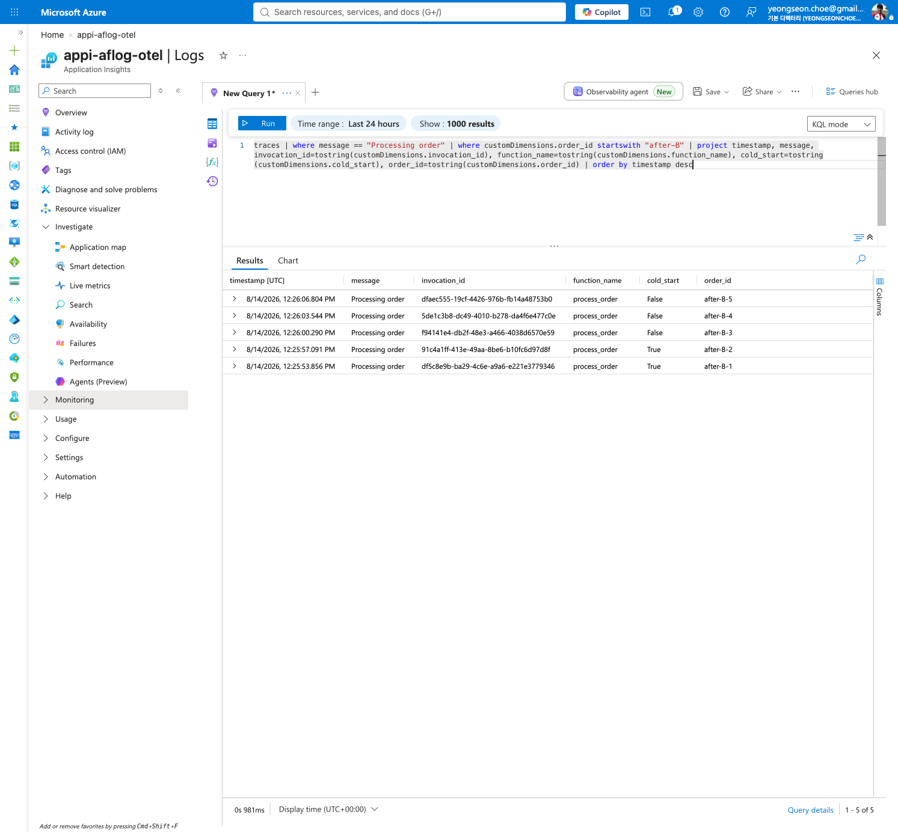
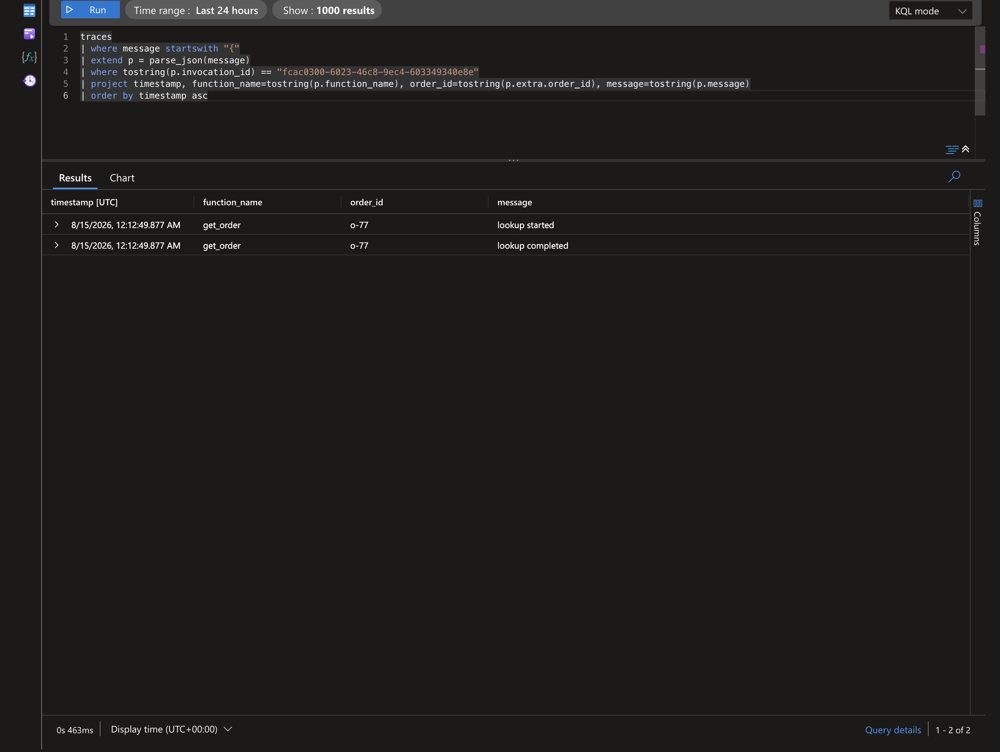
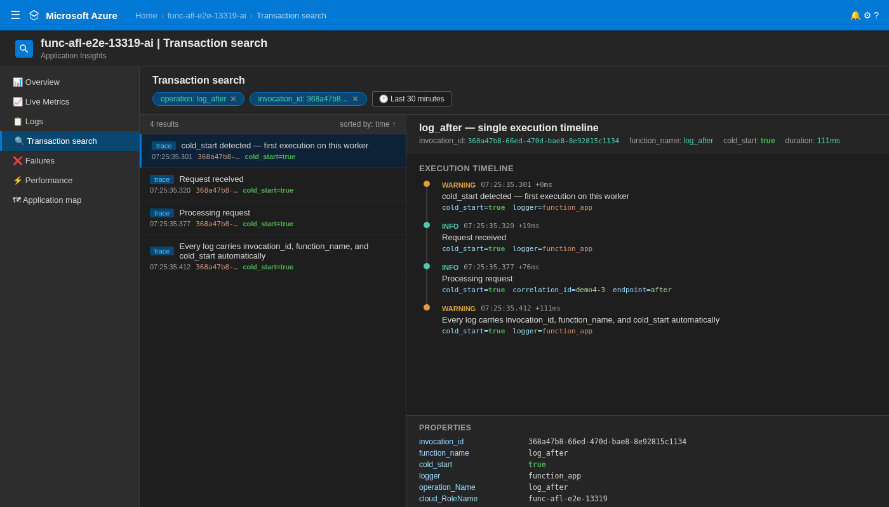

# Azure Functions Logging

> Part of the **Azure Functions Python DX Toolkit** — dogfood-tested by [azure-functions-cookbook-python](https://github.com/yeongseon/azure-functions-cookbook-python).

[](https://pypi.org/project/azure-functions-logging/)
[](https://pepy.tech/project/azure-functions-logging)
[](https://pypi.org/project/azure-functions-logging/)
[](https://github.com/yeongseon/azure-functions-logging-python/actions/workflows/ci-test.yml)
[](https://github.com/yeongseon/azure-functions-logging-python/actions/workflows/publish-pypi.yml)
[](https://github.com/yeongseon/azure-functions-logging-python/actions/workflows/security.yml)
[](https://codecov.io/gh/yeongseon/azure-functions-logging-python)
[](https://pre-commit.com/)
[](https://yeongseon.github.io/azure-functions-logging-python/)
[](LICENSE)

Read this in: [한국어](README.ko.md) | [日本語](README.ja.md) | [简体中文](README.zh-CN.md)

**Invocation-aware observability for Azure Functions Python v2.**
Surfaces `invocation_id`, detects cold starts, warns on `host.json` misconfig, and outputs Application Insights-ready structured logs — without replacing Python's standard `logging`.

---

Part of the **Azure Functions Python DX Toolkit**
→ Bring FastAPI-like developer experience to Azure Functions

## Why this exists

Azure Functions Python logging has specific failure modes that generic logging libraries don't address:

| Problem | What happens | This library |
|---------|-------------|--------------|
| `host.json` log level conflict | Your `INFO` logs silently disappear in Azure | Detects and warns at startup |
| No `invocation_id` in logs | Impossible to correlate logs to a specific execution | Auto-injects from `context` object |
| Cold start invisible | No signal when a new worker instance starts | Detects automatically on first `inject_context()` |
| Noisy third-party loggers | `azure-core`, `urllib3` flood your Application Insights | `SamplingFilter` / `RedactionFilter` |
| Local vs cloud output mismatch | Colorized output breaks in production pipelines | Environment-aware formatter switching |
| PII leaking into logs | Sensitive values accidentally logged as extra fields | `RedactionFilter` with key-based redaction |

## What it does

- **Invocation context** — auto-injects `invocation_id`, `function_name`, `cold_start` into every log
- **Structured JSON output** — Application Insights-ready NDJSON format for production
- **Noise control** — `SamplingFilter` rate-limits chatty third-party loggers
- **PII protection** — `RedactionFilter` masks sensitive fields before they reach log aggregation

> **Scope disclaimer.** This package writes structured JSON to Python `logging` / stdout. How those fields appear in Application Insights depends on the Azure Functions host, worker, logging configuration, and ingestion pipeline. The library does not own ingestion or schema mapping — both `customDimensions`-parsed and raw-`message` shapes are valid in production.

## Pipeline at a glance



> The two injection modes are **mutually exclusive**: do not attach `ContextFilter` when `use_record_factory=True`.

## Before / After

**Without** `azure-functions-logging` — plain `print()` output, no context, no structure:

```python
import azure.functions as func

app = func.FunctionApp()


@app.route(route="orders")
def process_order(req: func.HttpRequest) -> func.HttpResponse:
    print("Processing order")        # no invocation_id, no structure
    print(f"Order: {req.get_json()}")  # PII may leak, no log level
    return func.HttpResponse("OK")
```

Terminal output:

```
Processing order
Order: {'customer': 'Alice', 'total': 99.99}
```



> No invocation ID. No log level. Hard to correlate in Application Insights.

**With** `azure-functions-logging` — structured, queryable, production-ready:

```python
import azure.functions as func

from azure_functions_logging import JsonFormatter, get_logger, logging_context, setup_logging

setup_logging(functions_formatter=JsonFormatter())
logger = get_logger(__name__)
app = func.FunctionApp()


@app.route(route="orders")
def process_order(req: func.HttpRequest, context: func.Context) -> func.HttpResponse:
    with logging_context(context):
        logger.info("Processing order", order_id="o-999")
        return func.HttpResponse("OK")
```

Local terminal output when run standalone (e.g. `python app.py`, color formatter):

```
10:30:00 INFO     function_app  Processing order  [invocation_id=abc-123-def, function_name=process_order, cold_start=true]
```

Production output under `func start` / Azure (Application Insights NDJSON, applied because `functions_formatter` is set):

```json
{"timestamp": "2024-01-15T10:30:00+00:00", "level": "INFO", "logger": "function_app",
 "message": "Processing order", "invocation_id": "abc-123-def",
 "function_name": "process_order", "trace_id": null, "cold_start": true,
 "exception": null, "extra": {"order_id": "o-999"}}
```



> Every log carries `invocation_id` and `cold_start`. Queryable in Application Insights. Zero `print()` statements.

> **Note:** The exact Application Insights schema depends on your ingestion pipeline. In some deployments JSON fields are parsed into `customDimensions`; in others the JSON stays inside the `message` column. Examples for both shapes are below.

### Application Insights — Before / After

The following screenshots are from a real deployed Azure Functions app queried in Application Insights Logs.

**Before** — plain `logging.info()`, no `azure-functions-logging` (context fields not injected — `invocation_id`, `function_name`, `cold_start` are absent from the payload):



**After** — `azure-functions-logging` with `inject_context(context)` (`invocation_id`, `function_name`, `cold_start` populated):



**Drill-down by `invocation_id`** — one query, one execution, all logs in sequence:



**Transaction Search** — visual execution timeline with `cold_start`, structured fields, and per-event offsets:



### Query in Application Insights

#### When JSON fields are parsed into `customDimensions`

```kql
traces
| where customDimensions.invocation_id == "abc-123-def"
| project timestamp, message, customDimensions.cold_start, customDimensions.function_name
| order by timestamp asc
```

Find all cold starts in the last hour:

```kql
traces
| where customDimensions.cold_start == "true"
| where timestamp > ago(1h)
| summarize count() by bin(timestamp, 5m)
```

#### When JSON remains in the `message` column

```kql
traces
| extend payload = parse_json(message)
| where tostring(payload.invocation_id) == "abc-123-def"
| project timestamp, tostring(payload.message), tostring(payload.cold_start), tostring(payload.function_name)
| order by timestamp asc
```

Find all cold starts in the last hour:

```kql
traces
| extend payload = parse_json(message)
| where tostring(payload.cold_start) == "true"
| where timestamp > ago(1h)
| summarize count() by bin(timestamp, 5m)
```

## What this package does not do

This package does not own:

- **Replacing stdlib logging** — it wraps and enriches Python's standard `logging`, never replaces it
- **Distributed tracing** — use OpenTelemetry or Application Insights SDK for end-to-end trace correlation
- **API documentation** — use [`azure-functions-openapi`](https://github.com/yeongseon/azure-functions-openapi-python) for API documentation and spec generation

## Installation

```bash
pip install azure-functions-logging
```

## Quick Start

```python
import azure.functions as func
from azure_functions_logging import get_logger, logging_context, setup_logging

setup_logging()
logger = get_logger(__name__)

app = func.FunctionApp()

@app.route(route="hello")
def hello(req: func.HttpRequest, context: func.Context) -> func.HttpResponse:
    with logging_context(context):  # binds invocation_id, function_name, cold_start; restores previous context on exit
        logger.info("Request received")
        # log record now carries invocation_id, function_name, cold_start

        return func.HttpResponse("OK")
```

`logging_context` is the recommended primary pattern: it injects context on enter and **always** restores the previous context on exit (even when the handler raises), which prevents stale context from leaking into the next invocation on a reused worker.

For lower-level control or when integrating with custom middleware, use token-based restore:

```python
from azure_functions_logging import inject_context, restore_context

# Assumes `logger` and `context` are in scope (see Quick Start).
tokens = inject_context(context)
try:
    logger.info("Request received")
finally:
    restore_context(tokens)
```

Use `reset_context()` only when you intentionally want to clear all context (e.g. test teardown).

Start the Functions host locally (using the [e2e example app](examples/e2e_app)):

```bash
func start --script-root examples/e2e_app
```

### Verify locally and on Azure

After deploying (see [docs/deployment.md](docs/deployment.md)), the same request produces the same response in both environments.

#### Local

```bash
curl -s http://localhost:7071/api/logme?correlation_id=demo-123
```

```json
{"logged": true, "correlation_id": "demo-123"}
```

#### Azure

```bash
curl -s "https://<your-app>.azurewebsites.net/api/logme?correlation_id=demo-123"
```

```json
{"logged": true, "correlation_id": "demo-123"}
```

> Verified against a temporary Azure Functions deployment in koreacentral (Python 3.12, Consumption plan). Response captured and URL anonymized.

## Invocation Context

Use `logging_context()` to bind invocation context for the duration of a handler. It sets:

- `invocation_id` — unique per execution, correlates all logs for one request
- `function_name` — the Azure Functions function name
- `trace_id` — trace context from the platform; extracted only from valid W3C `traceparent` headers (strict validation, invalid values are ignored)
- `cold_start` — `True` on first invocation of this worker process

> **`cold_start` semantics.** `cold_start=True` means *the first invocation observed by this Python worker process after module load*. It is **not** a platform-level cold start metric and does not correspond to App Service plan / instance allocation cold starts reported by Azure Functions metrics. Subsequent invocations on the same worker emit `cold_start=False` until the worker is recycled.

```python
def my_function(req, context):
    with logging_context(context):
        logger.info("handler started")
        # every log from here carries invocation_id and cold_start
```

For lower-level control (e.g. middleware), use `inject_context()` with `restore_context()`:

```python
tokens = inject_context(context)
try:
    logger.info("handler started")
finally:
    restore_context(tokens)
```

Without context injection, these fields are `None` in every log line.

### `with_context` Decorator

For less boilerplate, use the `with_context` decorator instead of calling `inject_context()` manually:

```python
import azure.functions as func
from azure_functions_logging import get_logger, setup_logging, with_context

setup_logging()
logger = get_logger(__name__)

app = func.FunctionApp()

@app.route(route="hello")
@with_context
def hello(req: func.HttpRequest, context: func.Context) -> func.HttpResponse:
    logger.info("Request received")
    return func.HttpResponse("OK")
```

The decorator finds the `context` parameter by name, calls `inject_context()` before your handler runs, and restores the previous context in `finally` after it returns.

Custom parameter name:

```python
@with_context(param="ctx")
def hello(req: func.HttpRequest, ctx: func.Context) -> func.HttpResponse:
    ...
```

Both sync and async handlers are supported.

### Global LogRecordFactory (opt-in)

For applications where handlers may be added after `setup_logging()`, or where you want
invocation context on **every** `LogRecord` regardless of handler/filter configuration,
install the global context factory once at startup:

```python
from azure_functions_logging import install_context_factory, setup_logging

install_context_factory()  # injects context at record creation time
setup_logging()
```

When enabled, `invocation_id`, `function_name`, `trace_id`, and `cold_start` become
reserved `LogRecord` attributes. Passing them via stdlib `extra=` will raise `KeyError`.
Use `FunctionLogger` (which sanitizes keys automatically) or choose different key names.

> **Relationship with `setup_logging()`:** When `use_record_factory=False` (default),
> `setup_logging()` installs `ContextFilter` on handlers. You can call both — they set the
> same values, so there is no conflict. `install_context_factory()` ensures coverage even on
> handlers added later or loggers that bypass the filter chain.
>
> When `use_record_factory=True`, `setup_logging()` switches to the factory mode: it actively
> removes any `ContextFilter` instances from existing root handlers (cleanup), then registers
> the `LogRecordFactory`. This avoids double-injection while ensuring all records carry context
> regardless of handler/filter chain configuration.
## Structured JSON Output (Production)

Use JSON format when logs feed Application Insights or any aggregation system:

> **Note:** The `format` parameter only affects handlers created by this library (local development).
> In Azure Functions, the host manages handlers. Use `functions_formatter=JsonFormatter()` to set
> JSON output on host-managed handlers. Passing `format="json"` in Azure emits a warning.

For standalone local development or CI output:

```python
setup_logging(format="json")
```

For Azure Functions / Core Tools, the host owns the handlers. To force JSON
formatting on existing host-managed handlers:

```python
from azure_functions_logging import JsonFormatter, setup_logging

setup_logging(functions_formatter=JsonFormatter())
```

Output per log line (NDJSON — one JSON object per line):

```json
{"timestamp": "2024-01-15T10:30:00+00:00", "level": "INFO", "logger": "my_module",
 "message": "order accepted", "invocation_id": "abc-123", "function_name": "OrderHandler",
 "cold_start": false, "trace_id": "4bf92f3577b34da6a3ce929d0e0e4736", "exception": null,
 "extra": {"order_id": "o-999"}}
```

Extra fields appear under `extra` in the emitted JSON. Whether they are directly indexable in Application Insights depends on your ingestion pipeline: when JSON is parsed into `customDimensions` they are queryable directly; when the JSON stays in the `message` column you need `parse_json(message)` first.

```python
logger.info("order accepted", order_id="o-999", tenant_id="t-1")
```

### Truncating long string values (opt-in)

By default, `JsonFormatter` leaves string values in `extra` at full length.
Pass `truncate_native_strings=True` to clip them at `max_string_length` characters (default 2048).
Truncated strings are suffixed with `…` so the cut-off is detectable:

```python
from azure_functions_logging import JsonFormatter, setup_logging

setup_logging(functions_formatter=JsonFormatter(
    truncate_native_strings=True,
    max_string_length=512,  # clip strings longer than 512 chars
))
```

> **Scope:** Only string values in `extra` are truncated (recursively through dicts and lists).
> The `message` field, integers, floats, and booleans are not affected.
> Unserializable objects fall through to the existing `_json_default` path which truncates
> their `str()` representation to 2048 characters regardless of this setting.
## host.json Conflict Detection

If your `host.json` suppresses log levels that your app emits, you get this warning at startup:

```
host.json logLevel for default is set to 'Warning' which is more restrictive than the configured level 'INFO'. Logs below 'Warning' will be suppressed by the Azure Functions host.
```

Recommended `host.json` baseline:

```json
{
  "version": "2.0",
  "logging": {
    "logLevel": {
      "default": "Information",
      "Function": "Information"
    }
  }
}
```

### Discovery order

`host.json` is located by walking up from the current working directory (or from
`AzureWebJobsScriptRoot` when that environment variable is set):

| Priority | Source |
|----------|--------|
| 1 | Explicit `host_json_path` parameter passed to `setup_logging()` |
| 2 | `AzureWebJobsScriptRoot` environment variable |
| 3 | `cwd/host.json` and each parent directory, up to 5 levels |

The first existing `host.json` wins. `AzureWebJobsScriptRoot` is the canonical env var
set by the Azure Functions host; only the directory itself is probed (no ancestor walk).
The first existing file wins. To bypass auto-discovery (e.g. in tests or
non-standard layouts), pass an explicit path:

The warning also considers Azure Functions app setting overrides that use the
`AzureFunctionsJobHost__logging__logLevel__...` convention, for example
`AzureFunctionsJobHost__logging__logLevel__Function__MyFunction=Warning`.

```python
from pathlib import Path
from azure_functions_logging import setup_logging

setup_logging(host_json_path=Path("/site/wwwroot/host.json"))
```

## Noise Control

Suppress chatty third-party loggers without removing them:

```python
from azure_functions_logging import SamplingFilter, setup_logging
import logging

setup_logging()

# Sample noisy azure.* loggers: keep up to 10 records per logger per 1-second window.
# Filters attached to a logger don't run for records propagated from
# descendants, so attach to the root handlers and scope by logger name.
for handler in logging.getLogger().handlers:
    handler.addFilter(SamplingFilter(rate=10, name="azure", per_logger=True))

# Silence urllib3 completely in production
logging.getLogger("urllib3").setLevel(logging.WARNING)
```

## PII Redaction

Strip sensitive fields before they reach Application Insights:

```python
from azure_functions_logging import RedactionFilter, setup_logging
import logging

setup_logging()
root = logging.getLogger()
# Attach the filter to handlers so records from named child loggers are also redacted.
for handler in root.handlers:
    handler.addFilter(RedactionFilter())
```

Any log record with extra fields whose keys match a sensitive key will have those values replaced with `***`.

**Default sensitive keys** (case-insensitive, applied to nested dicts and lists too):

| Key | Key | Key |
|-----|-----|-----|
| `password` | `passwd` | `pwd` |
| `token` | `access_token` | `refresh_token` |
| `id_token` | `authorization` | `auth` |
| `secret` | `client_secret` | `secret_key` |
| `api_key` | `apikey` | `subscription_key` |
| `connection_string` | `conn_str` | `sas_token` |
| `x_functions_key` | `function_key` | `master_key` |
| `private_key` | `credential` | |

Pass `sensitive_keys=[...]` to override with your own list:

```python
handler.addFilter(RedactionFilter(sensitive_keys=["account_number", "ssn"]))
```

## Local vs Cloud

| Environment | Format | Behavior |
|-------------|--------|---------|
| Local terminal | `color` (default) | Colorized human-readable: `HH:MM:SS LEVEL logger  message [context...]` |
| Azure / Core Tools | host-managed | Installs context filters only; pass `functions_formatter=JsonFormatter()` to force NDJSON on host handlers |
| CI / pipeline | `json` | NDJSON, machine-parseable |

`setup_logging()` detects `FUNCTIONS_WORKER_RUNTIME` to distinguish Azure Functions / Core Tools from standalone local execution. In Azure mode it installs context filters without adding handlers (avoids duplicate output from the host pipeline).

## Context Binding

Attach request-scoped metadata to every log without passing it through every call:

```python
def process_order(order_id: str) -> None:
    order_logger = logger.bind(order_id=order_id, region="eastus")
    order_logger.info("processing started")   # includes order_id + region
    order_logger.info("processing complete")  # same metadata, new message
```

Create bound loggers per-invocation. Do not cache them at module level.

## When to use

- You need structured, queryable logs in Application Insights
- You want `invocation_id` correlation across all logs for a single request
- You need cold start detection without custom instrumentation
- You want PII redaction or noise control for third-party loggers
- Your `host.json` config silently suppresses logs and you don't know why

## Documentation

- Full docs: [yeongseon.github.io/azure-functions-logging-python](https://yeongseon.github.io/azure-functions-logging-python/)
- [Configuration reference](https://yeongseon.github.io/azure-functions-logging-python/configuration/)
- [Troubleshooting guide](https://yeongseon.github.io/azure-functions-logging-python/troubleshooting/)
- [API reference](https://yeongseon.github.io/azure-functions-logging-python/api/)

## Ecosystem

This package is part of the **Azure Functions Python DX Toolkit**.

**Design principle:** `azure-functions-logging` owns structured logging and invocation-aware observability. It enriches Python's standard `logging` — it does not replace it. Adjacent concerns belong to [`azure-functions-openapi`](https://github.com/yeongseon/azure-functions-openapi-python) (API documentation and spec generation), [`azure-functions-validation`](https://github.com/yeongseon/azure-functions-validation-python) (request/response validation and serialization), and [`azure-functions-langgraph`](https://github.com/yeongseon/azure-functions-langgraph-python) (LangGraph runtime exposure).

| Package | Role |
|---------|------|
| [azure-functions-openapi-python](https://github.com/yeongseon/azure-functions-openapi-python) | OpenAPI spec generation and Swagger UI |
| [azure-functions-validation-python](https://github.com/yeongseon/azure-functions-validation-python) | Request/response validation and serialization |
| [azure-functions-db-python](https://github.com/yeongseon/azure-functions-db-python) | Database bindings for SQL, PostgreSQL, MySQL, SQLite, and Cosmos DB |
| [azure-functions-langgraph-python](https://github.com/yeongseon/azure-functions-langgraph-python) | LangGraph deployment adapter for Azure Functions |
| [azure-functions-scaffold-python](https://github.com/yeongseon/azure-functions-scaffold-python) | Project scaffolding CLI |
| **azure-functions-logging-python** | Structured logging and observability |
| [azure-functions-doctor-python](https://github.com/yeongseon/azure-functions-doctor-python) | Pre-deploy diagnostic CLI |
| [azure-functions-durable-graph-python](https://github.com/yeongseon/azure-functions-durable-graph-python) | Manifest-first graph runtime with Durable Functions *(experimental)* |
| [azure-functions-knowledge-python](https://github.com/yeongseon/azure-functions-knowledge-python) | Knowledge retrieval (RAG) decorators |
| [azure-functions-cookbook-python](https://github.com/yeongseon/azure-functions-cookbook-python) | Dogfood examples — runnable recipes that exercise the full toolkit |


## For AI Coding Assistants

This package provides structured logging for Azure Functions with zero modifications to stdlib logging.

**LLM-Friendly Resources:**
- `llms.txt` — Concise API reference and quick start (repo root)
- `llms-full.txt` — Complete API signatures, patterns, and design principles (repo root)

**Key Implementation Details for Code Generation:**

1. **Preserves host configuration** — In Azure / Core Tools, no handlers are added and the root logger level is left to `host.json`; `ContextFilter` is installed on existing root handlers and on the root logger itself (so direct calls on the root logger carry context). For records that propagate from named child loggers to handlers attached later (e.g. by the host or third-party libraries), call `install_context_factory()` to guarantee context coverage. In standalone local mode, `setup_logging(logger_name=None)` configures the root logger (sets level, adds a `StreamHandler` if none exist).
2. **Context injection is contextvar-based** — Not thread-local, works with asyncio
3. **Idempotent setup** — Calling setup_logging() multiple times is safe
4. **Two environments, two behaviors**:
   - Azure/Core Tools: install `ContextFilter` on existing root handlers and on the root logger itself; do not add handlers or change the root level (respects `host.json`).
   - Standalone local: set the target/root logger level; add a `StreamHandler` (ColorFormatter or JsonFormatter) **only if no handlers exist**, otherwise just attach filters to existing handlers.
5. **Test-friendly**:
   - `inject_context()` accepts any object (no hard dependency on azure.functions.Context)
   - `with_context` decorator works with sync and async handlers
   - Use `reset_context()` in test teardown if needed

**When generating code:**
- Import only from `azure_functions_logging` public API (no underscores)
- Call `setup_logging()` at module level or handler startup (not per-request)
- Prefer `with logging_context(context):` in handlers; use raw `inject_context(context)` only with `try/finally restore_context(tokens)`
- Use `logger.bind(key=value)` for per-request fields (not direct logger.extra)
- Use `with_context` decorator if you prefer to inject context implicitly per-handler
- Call `get_logging_metadata(func)` to inspect `@with_context` metadata on a function (returns `dict[str, Any] | None`)
- Apply `RedactionFilter` for PII fields, `SamplingFilter` for high-volume logs

**Example Pattern:**
```python
from azure_functions_logging import get_logger, logging_context, setup_logging

# Module level
setup_logging()
logger = get_logger(__name__)

# Per handler
def my_function(req: func.HttpRequest, context: func.Context) -> func.HttpResponse:
    with logging_context(context):
        req_logger = logger.bind(correlation_id=req.params.get("id"))
        req_logger.info("Processing")
        return func.HttpResponse("OK")
```


This project is an independent community project and is not affiliated with,
endorsed by, or maintained by Microsoft.

Azure and Azure Functions are trademarks of Microsoft Corporation.

## License

MIT
