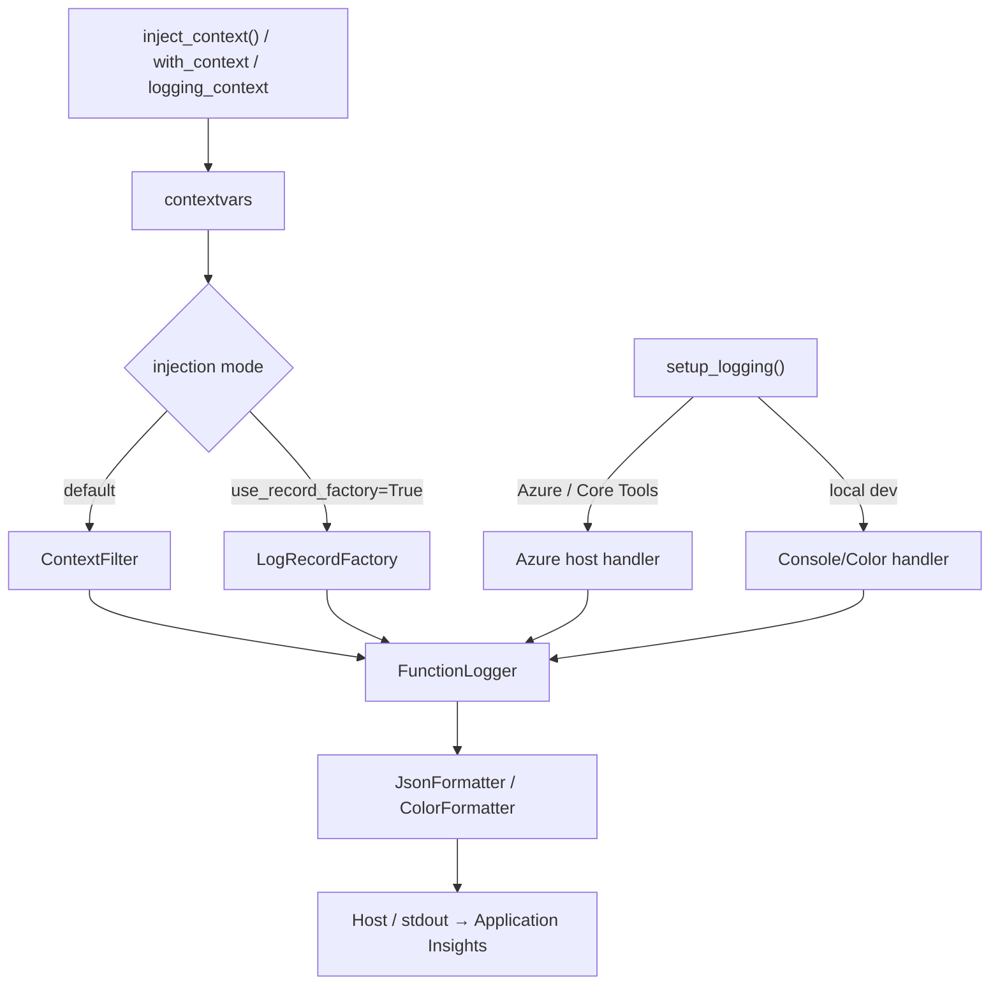

# Azure Functions Logging

> Part of the **Azure Functions Python DX Toolkit** — dogfood-tested by [azure-functions-cookbook-python](https://github.com/yeongseon/azure-functions-cookbook-python).

[](https://pypi.org/project/azure-functions-logging/)
[](https://pepy.tech/project/azure-functions-logging)
[](https://pypi.org/project/azure-functions-logging/)
[](https://github.com/yeongseon/azure-functions-logging-python/actions/workflows/ci-test.yml)
[](https://github.com/yeongseon/azure-functions-logging-python/actions/workflows/publish-pypi.yml)
[](https://github.com/yeongseon/azure-functions-logging-python/actions/workflows/security.yml)
[](https://codecov.io/gh/yeongseon/azure-functions-logging-python)
[](https://pre-commit.com/)
[](https://yeongseon.dev/azure-functions-python/logging/)
[](LICENSE)

Read this in: [한국어](README.ko.md) | [日本語](README.ja.md) | [简体中文](README.zh-CN.md)

**Invocation-aware observability for Azure Functions Python v2.**
Surfaces `invocation_id`, detects cold starts, warns on `host.json` misconfig, and outputs Application Insights-ready structured logs — without replacing Python's standard `logging`.

---

## Why this exists

Azure Functions Python logging has specific failure modes that generic logging libraries don't address:

| Problem | What happens | This library |
|---------|-------------|--------------|
| `host.json` log level conflict | Your `INFO` logs silently disappear in Azure | Detects and warns at startup |
| No `invocation_id` in logs | Impossible to correlate logs to a specific execution | Auto-injects from `context` object |
| Cold start invisible | No signal when a new worker instance starts | Detects automatically on first `inject_context()` |
| Noisy third-party loggers | `azure-core`, `urllib3` flood your Application Insights | `SamplingFilter` / `RedactionFilter` |
| Local vs cloud output mismatch | Colorized output breaks in production pipelines | Environment-aware formatter switching |
| PII leaking into logs | Sensitive values accidentally logged as extra fields | `RedactionFilter` with key-based redaction |
| Worker logs orphaned from the invocation trace | Worker log records fall back to `span_id=0`, detached from the host's invocation span | Binds the host's W3C trace context so your OpenTelemetry logs inherit the invocation's `trace_id` / `span_id` ([details](#opentelemetry-trace-correlation)) |

## What it does

- **Invocation context** — auto-injects `invocation_id`, `function_name`, `cold_start`, and `host_instance_id` (the scaled-out worker instance) into every log
- **Structured JSON output** — Application Insights-ready NDJSON format for production
- **Noise control** — `SamplingFilter` rate-limits chatty third-party loggers
- **PII protection** — `RedactionFilter` masks sensitive fields before they reach log aggregation

> **Scope disclaimer.** This package writes structured JSON to Python `logging` / stdout. How those fields appear in Application Insights depends on the Azure Functions host, worker, logging configuration, and ingestion pipeline. The library does not own ingestion or schema mapping — both `customDimensions`-parsed and raw-`message` shapes are valid in production.

## OpenTelemetry trace correlation

> **Python is the only Azure Functions worker runtime without built-in OpenTelemetry invocation middleware.** The host emits a W3C `traceparent` for every invocation, but the Python worker never activates it in-process — so unless you activate a span yourself, worker log records are stamped with `span_id=0` and get orphaned from the host's invocation span.

You *can* close this gap by hand, but it's manual and easy to forget. structlog, Loguru, and stdlib `logging` all rely on OpenTelemetry's `LoggingHandler` / `LoggingInstrumentor`, which only stamp `trace_id` / `span_id` when there is an **active span in the process**. Because the Python worker never activates one, Microsoft's documented pattern is to extract the host's `traceparent` and start a span yourself — in **every handler**. Miss it in one path and those records silently fall back to `span_id=0`.

`azure-functions-logging` fills that gap. Opt in with `activate_trace_context=True` (requires the `[otel]` extra) and the library binds the host's W3C trace context for the duration of the handler, so your existing OpenTelemetry log records inherit the invocation's `trace_id` / `span_id`:

```python
from azure_functions_logging import logging_context, setup_logging

setup_logging(activate_trace_context=True)  # requires: pip install azure-functions-logging[otel]

with logging_context(context):
    logger.info("processing")  # OpenTelemetry record inherits the invocation trace_id / span_id
```

This is **correlation, not tracing** — the library never creates, records, or exports spans itself. It is complementary to (not a replacement for) OpenTelemetry or the Application Insights SDK, which remain responsible for producing spans. See the [OpenTelemetry trace correlation guide](https://yeongseon.dev/azure-functions-python/logging/opentelemetry/).

Prefer per-call activation? Skip the process-wide default and pass it directly: `with logging_context(context, activate_trace_context=True):`.


## Pipeline at a glance



> The two injection modes are **mutually exclusive**: do not attach `ContextFilter` when `use_record_factory=True`.

## Before / After

**Without** `azure-functions-logging` — you already use Python's standard `logging`, done correctly:

```python
import logging

import azure.functions as func

logging.basicConfig(level=logging.INFO)
logger = logging.getLogger(__name__)
app = func.FunctionApp()


@app.route(route="orders")
def process_order(req: func.HttpRequest) -> func.HttpResponse:
    logger.info("Processing order")  # correct logging — but no invocation context
    return func.HttpResponse("OK")
```

Terminal output:

```
INFO:function_app:Processing order
```


> Your logging is fine. But there's no `invocation_id` to correlate concurrent executions, no `cold_start` signal, and on Azure your `host.json` level can silently drop this line — none of which standard `logging` knows about on Azure Functions.

**With** `azure-functions-logging` — structured, queryable, production-ready:

```python
import azure.functions as func

from azure_functions_logging import JsonFormatter, get_logger, logging_context, setup_logging

setup_logging(functions_formatter=JsonFormatter())
logger = get_logger(__name__)
app = func.FunctionApp()


@app.route(route="orders")
def process_order(req: func.HttpRequest, context: func.Context) -> func.HttpResponse:
    with logging_context(context):
        logger.info("Processing order", order_id="o-42")
        return func.HttpResponse("OK")
```

Local terminal output when run standalone (e.g. `python app.py`, color formatter):

```
10:47:06 INFO     function_app  Processing order  [invocation_id=706b8e5c-a630-4309-b815-6410526f237a, function_name=process_order, cold_start=true]
```

Production output under `func start` / Azure (Application Insights NDJSON, applied because `functions_formatter` is set):

```json
{"timestamp": "2026-08-15T01:47:55.201145+00:00", "level": "INFO", "logger": "function_app",
 "message": "Processing order", "invocation_id": "706b8e5c-a630-4309-b815-6410526f237a",
 "function_name": "process_order", "trace_id": null, "span_id": null, "cold_start": true,
 "host_instance_id": "3c9f1e7a8b2d4f6019a5c8e2b7d0a4f3", "exception": null,
 "extra": {"order_id": "o-42"}}
```


> Every log carries `invocation_id` and `cold_start`. Same standard `logging` calls — now correlated and queryable in Application Insights.

> **Note:** The exact Application Insights schema depends on your ingestion pipeline. In some deployments JSON fields are parsed into `customDimensions`; in others the JSON stays inside the `message` column. Examples for both shapes are below.

### Application Insights — Before / After

The following screenshots are from a real deployed Azure Functions app queried in Application Insights Logs.

**Before** — plain `logging.info()`, no `azure-functions-logging` (context fields not injected — `invocation_id`, `function_name`, `cold_start` are absent from the payload):


**After** — `azure-functions-logging` with `inject_context(context)` (`invocation_id`, `function_name`, `cold_start` populated):


**Drill-down by `invocation_id`** — one query, one execution, all logs in sequence:


**Transaction Search** — visual execution timeline with `cold_start`, structured fields, and per-event offsets:


### Query in Application Insights

#### When JSON remains in the `message` column

This is the shape shown in the screenshots above — the structured JSON stays inside `message`, so parse it with `parse_json(message)`:

```kql
traces
| extend payload = parse_json(message)
| where tostring(payload.invocation_id) == "abc-123-def"
| project timestamp, tostring(payload.message), tostring(payload.cold_start), tostring(payload.function_name)
| order by timestamp asc
```

Find all cold starts in the last hour:

```kql
traces
| extend payload = parse_json(message)
| where tostring(payload.cold_start) == "true"
| where timestamp > ago(1h)
| summarize count() by bin(timestamp, 5m)
```

#### When JSON fields are parsed into `customDimensions`

If your pipeline promotes the JSON fields into `customDimensions`, read them directly:

```kql
traces
| where customDimensions.invocation_id == "abc-123-def"
| project timestamp, message, customDimensions.cold_start, customDimensions.function_name
| order by timestamp asc
```

Find all cold starts in the last hour:

```kql
traces
| where customDimensions.cold_start == "true"
| where timestamp > ago(1h)
| summarize count() by bin(timestamp, 5m)
```

## What this package does not do

This package does not own:

- **Replacing stdlib logging** — it wraps and enriches Python's standard `logging`, never replaces it
- **Distributed tracing** — it correlates logs to the invocation span but never creates, records, or exports spans itself (see [OpenTelemetry trace correlation](#opentelemetry-trace-correlation)); use OpenTelemetry or the Application Insights SDK to produce spans
- **API documentation** — use [`azure-functions-openapi`](https://github.com/yeongseon/azure-functions-openapi-python) for API documentation and spec generation

## Installation

```bash
pip install azure-functions-logging
```

## Quick Start

```python
import azure.functions as func
from azure_functions_logging import get_logger, logging_context, setup_logging

setup_logging()
logger = get_logger(__name__)

app = func.FunctionApp()

@app.route(route="hello")
def hello(req: func.HttpRequest, context: func.Context) -> func.HttpResponse:
    with logging_context(context):  # binds invocation_id, function_name, cold_start; restores previous context on exit
        logger.info("Request received")
        # log record now carries invocation_id, function_name, cold_start

        return func.HttpResponse("OK")
```

`logging_context` is the recommended primary pattern: it injects context on enter and **always** restores the previous context on exit (even when the handler raises), which prevents stale context from leaking into the next invocation on a reused worker.

For lower-level control or when integrating with custom middleware, use token-based restore:

```python
from azure_functions_logging import inject_context, restore_context

# Assumes `logger` and `context` are in scope (see Quick Start).
tokens = inject_context(context)
try:
    logger.info("Request received")
finally:
    restore_context(tokens)
```

Use `reset_context()` only when you intentionally want to clear all context (e.g. test teardown).

Start the Functions host locally (using the [e2e example app](examples/e2e_app)):

```bash
func start --script-root examples/e2e_app
```

### Verify locally and on Azure

After deploying (see [docs/deployment.md](docs/deployment.md)), the same request produces the same response in both environments.

#### Local

```bash
curl -s http://localhost:7071/api/logme?correlation_id=demo-123
```

```json
{"logged": true, "correlation_id": "demo-123"}
```

#### Azure

```bash
curl -s "https://<your-app>.azurewebsites.net/api/logme?correlation_id=demo-123"
```

```json
{"logged": true, "correlation_id": "demo-123"}
```

> Verified against a temporary Azure Functions deployment in koreacentral (Python 3.12, Consumption plan). Response captured and URL anonymized.

## Core capabilities

Every capability below has a full how-to on the [documentation site](https://yeongseon.dev/azure-functions-python/logging/) — this section summarizes what each does and links to the single source, so the README stays a quick overview rather than a second copy of the docs.

### Invocation context

`logging_context(context)` (see [Quick Start](#quick-start)) binds `invocation_id`, `function_name`, `trace_id`, and `cold_start` for the duration of a handler and always restores the previous context on exit. For lower-level control use `inject_context()` / `restore_context()`, or the `@with_context` decorator to inject implicitly (sync and async handlers).

> **`cold_start` semantics.** `cold_start=True` means the first invocation observed by this Python worker process after module load — **not** a platform-level cold-start metric.

> **Worker instance.** Every record also carries `host_instance_id`, a best-effort identifier of the worker instance that produced the log (resolved from `WEBSITE_INSTANCE_ID` → `WEBSITE_POD_NAME` → `CONTAINER_NAME` → `socket.gethostname()`). It is complementary to, but not guaranteed equal to, Application Insights' `cloud_RoleInstance`.

→ [Usage: context injection](https://yeongseon.dev/azure-functions-python/logging/usage/#3-context-injection-in-azure-functions) · [API: `with_context`](https://yeongseon.dev/azure-functions-python/logging/api/#with_context)

### Structured JSON output

Pass `setup_logging(functions_formatter=JsonFormatter())` to emit Application Insights-ready NDJSON on host-managed handlers (or `format="json"` for standalone/CI). Extra fields land under `extra`; opt into `truncate_native_strings=True` to clip long string values.

→ [Usage: JSON output](https://yeongseon.dev/azure-functions-python/logging/usage/#2-json-output-for-production) · [API: `JsonFormatter`](https://yeongseon.dev/azure-functions-python/logging/api/#jsonformatter)

### host.json conflict detection

At startup the library warns when your `host.json` — or `AzureFunctionsJobHost__logging__logLevel__...` app-setting overrides — suppresses levels your app emits. `host.json` is auto-discovered by walking up from the working directory (or `AzureWebJobsScriptRoot`); pass `host_json_path=` to override.

→ [Configuration: host.json conflict](https://yeongseon.dev/azure-functions-python/logging/configuration/#hostjson-level-conflict-warning) · [Troubleshooting](https://yeongseon.dev/azure-functions-python/logging/troubleshooting/#hostjson-conflict-warning-appears)

### Noise control & PII redaction

`SamplingFilter` rate-limits chatty third-party loggers (e.g. `azure-core`, `urllib3`); `RedactionFilter` masks sensitive keys (passwords, tokens, secrets, connection strings, and more — case-insensitive, recursive) before logs reach aggregation. Attach either to your root handlers, and pass `sensitive_keys=[...]` to customize redaction.

→ [API: `SamplingFilter`](https://yeongseon.dev/azure-functions-python/logging/api/#samplingfilter) · [API: `RedactionFilter`](https://yeongseon.dev/azure-functions-python/logging/api/#redactionfilter)

### Context binding

`logger.bind(key=value)` returns a logger that attaches request-scoped metadata to every subsequent log without threading it through each call. Create bound loggers per-invocation; don't cache them at module level.

→ [Usage: context binding](https://yeongseon.dev/azure-functions-python/logging/usage/#4-context-binding-with-functionloggerbind)

### Global LogRecordFactory (opt-in)

`setup_logging(use_record_factory=True)` installs a global `LogRecordFactory` that injects context at record-creation time so **every** `LogRecord` carries it regardless of handler/filter wiring — useful when handlers are added after `setup_logging()` or loggers bypass the filter chain. It is mutually exclusive with the default `ContextFilter` mode.

→ [Configuration: `use_record_factory`](https://yeongseon.dev/azure-functions-python/logging/configuration/#parameter-use_record_factory)

### Local vs cloud

`setup_logging()` detects `FUNCTIONS_WORKER_RUNTIME`: colorized human-readable output locally, host-managed NDJSON in Azure / Core Tools (context filters only — no duplicate handlers), and machine-parseable JSON in CI.

→ [Configuration: environment detection](https://yeongseon.dev/azure-functions-python/logging/configuration/#environment-detection)

## When to use

- You need structured, queryable logs in Application Insights
- You want `invocation_id` correlation across all logs for a single request
- You need cold start detection without custom instrumentation
- You want PII redaction or noise control for third-party loggers
- Your `host.json` config silently suppresses logs and you don't know why

## Common symptoms → fixes

Arriving with a symptom rather than a feature name? Start here. Each entry lists the minimal setup, what the resulting log proves, and — just as importantly — what it *cannot* prove.

<details>
<summary><strong>My <code>INFO</code> logs are invisible in Azure</strong></summary>

**Likely cause:** a `host.json` log level (or an `AzureFunctionsJobHost__logging__logLevel__...` app setting) is suppressing the level your app emits.

```python
setup_logging()  # warns at startup if host.json suppresses a level you emit
```

**What you'll see:** a startup warning naming the conflicting level. **Proves:** your configured level is dropping records. **Does not prove:** that the record ever reached Application Insights ingestion — that is a separate pipeline concern.

→ [host.json conflict detection](#hostjson-conflict-detection)
</details>

<details>
<summary><strong>Logs from different invocations are interleaved</strong></summary>

```python
with logging_context(context):
    logger.info("Processing order")
```

Every record now carries `invocation_id`. Filter by it (see [Query in Application Insights](#query-in-application-insights)) to isolate a single execution. **Proves:** which records belong to the same invocation. **Does not prove:** ordering across workers — timestamps are per-process.

→ [Invocation context](#invocation-context)
</details>

<details>
<summary><strong>I want to know whether only the first request is slow</strong></summary>

Every record carries `cold_start`. To find first-invocation records, query it using the shape that matches your ingestion pipeline — `tostring(payload.cold_start) == "true"` when the JSON stays in `message`, or `customDimensions.cold_start == "true"` when fields are promoted (see [Query in Application Insights](#query-in-application-insights)).

> **Caveat:** `cold_start=True` means the first invocation observed by *this Python worker process* after module load — **not** a platform-level cold-start metric. It does not measure host allocation or worker startup time before the first instrumented invocation.

→ [Invocation context](#invocation-context)
</details>

<details>
<summary><strong>Which worker instance produced this error?</strong></summary>

Every record carries `host_instance_id`, a best-effort identifier of the worker instance (resolved from `WEBSITE_INSTANCE_ID` → `WEBSITE_POD_NAME` → `CONTAINER_NAME` → `socket.gethostname()`). **Proves:** records sharing an instance id came from the same worker. **Does not prove:** equality with Application Insights' `cloud_RoleInstance` — it is complementary, not guaranteed identical.

→ [Invocation context](#invocation-context)
</details>

<details>
<summary><strong>Azure SDK / third-party loggers are too noisy</strong></summary>

```python
import logging

from azure_functions_logging import SamplingFilter

logging.getLogger("azure.core.pipeline.policies.http_logging_policy").addFilter(SamplingFilter(rate=10))  # keep at most 10 records/sec
```

`SamplingFilter` rate-limits chatty loggers before they reach aggregation. **Proves nothing about correctness** — it deliberately drops records, so do not sample loggers you need complete.

→ [Noise control & PII redaction](#noise-control--pii-redaction)
</details>

<details>
<summary><strong>I'm worried sensitive values are being logged</strong></summary>

```python
import logging

from azure_functions_logging import RedactionFilter

for handler in logging.getLogger().handlers:
    handler.addFilter(RedactionFilter())  # masks passwords, tokens, secrets, connection strings — recursive, case-insensitive
```

**Proves:** matched keys are masked before records leave the process. **Does not prove:** protection for secrets embedded inside free-text messages — redaction is key-based; pass `sensitive_keys=[...]` to extend coverage.

→ [Noise control & PII redaction](#noise-control--pii-redaction)
</details>

<details>
<summary><strong>I want worker logs correlated to the invocation trace</strong></summary>

```python
setup_logging(activate_trace_context=True)  # requires: pip install azure-functions-logging[otel]

with logging_context(context):
    logger.info("processing")  # OpenTelemetry record inherits the invocation trace_id / span_id
```

**Proves:** your existing OpenTelemetry log records inherit the host invocation's `trace_id` / `span_id`. **Does not prove:** a span was created or exported — this is correlation, not tracing (see [OpenTelemetry trace correlation](#opentelemetry-trace-correlation)).
</details>

## Documentation

- Full docs: [yeongseon.dev/azure-functions-python/logging](https://yeongseon.dev/azure-functions-python/logging/)
- [Configuration reference](https://yeongseon.dev/azure-functions-python/logging/configuration/)
- [Troubleshooting guide](https://yeongseon.dev/azure-functions-python/logging/troubleshooting/)
- [API reference](https://yeongseon.dev/azure-functions-python/logging/api/)

## Ecosystem

This package is part of the **Azure Functions Python DX Toolkit**.

**Design principle:** `azure-functions-logging` owns structured logging and invocation-aware observability. It enriches Python's standard `logging` — it does not replace it. Adjacent concerns belong to [`azure-functions-openapi`](https://github.com/yeongseon/azure-functions-openapi-python) (API documentation and spec generation), [`azure-functions-validation`](https://github.com/yeongseon/azure-functions-validation-python) (request/response validation and serialization), and [`azure-functions-langgraph`](https://github.com/yeongseon/azure-functions-langgraph-python) (LangGraph runtime exposure).

| Package | Role |
|---------|------|
| [azure-functions-openapi-python](https://github.com/yeongseon/azure-functions-openapi-python) | OpenAPI spec generation and Swagger UI |
| [azure-functions-validation-python](https://github.com/yeongseon/azure-functions-validation-python) | Request/response validation and serialization |
| [azure-functions-db-python](https://github.com/yeongseon/azure-functions-db-python) | SQLAlchemy-powered DB integration helpers (poll-based pseudo trigger, input/output/client injection) |
| [azure-functions-langgraph-python](https://github.com/yeongseon/azure-functions-langgraph-python) | LangGraph deployment adapter for Azure Functions |
| [azure-functions-scaffold-python](https://github.com/yeongseon/azure-functions-scaffold-python) | Project scaffolding CLI |
| **azure-functions-logging-python** | Structured logging and observability |
| [azure-functions-doctor-python](https://github.com/yeongseon/azure-functions-doctor-python) | Pre-deploy diagnostic CLI |
| [azure-functions-durable-graph-python](https://github.com/yeongseon/azure-functions-durable-graph-python) | Manifest-first graph runtime with Durable Functions *(experimental)* |
| [azure-functions-knowledge-python](https://github.com/yeongseon/azure-functions-knowledge-python) | Knowledge retrieval (RAG) decorators |
| [azure-functions-cookbook-python](https://github.com/yeongseon/azure-functions-cookbook-python) | Dogfood examples — runnable recipes that exercise the full toolkit |


## For AI Coding Assistants

This package provides structured logging for Azure Functions with zero modifications to stdlib logging.

**LLM-Friendly Resources:**
- `llms.txt` — Concise API reference and quick start (repo root)
- `llms-full.txt` — Complete API signatures, patterns, and design principles (repo root)

**Key Implementation Details for Code Generation:**

1. **Preserves host configuration** — In Azure / Core Tools, no handlers are added and the root logger level is left to `host.json`; `ContextFilter` is installed on existing root handlers and on the root logger itself (so direct calls on the root logger carry context). For records that propagate from named child loggers to handlers attached later (e.g. by the host or third-party libraries), pass `use_record_factory=True` to `setup_logging()` to guarantee context coverage. In standalone local mode, `setup_logging(logger_name=None)` configures the root logger (sets level, adds a `StreamHandler` if none exist).
2. **Context injection is contextvar-based** — Not thread-local, works with asyncio
3. **Idempotent setup** — Calling setup_logging() multiple times is safe
4. **Test-friendly**:
   - `inject_context()` accepts any object (no hard dependency on azure.functions.Context)
   - `with_context` decorator works with sync and async handlers
   - Use `reset_context()` in test teardown if needed

**When generating code:**
- Import only from `azure_functions_logging` public API (no underscores)
- Call `setup_logging()` at module level or handler startup (not per-request)
- Prefer `with logging_context(context):` in handlers; use raw `inject_context(context)` only with `try/finally restore_context(tokens)`
- Use `logger.bind(key=value)` for per-request fields (not direct logger.extra)
- Use `with_context` decorator if you prefer to inject context implicitly per-handler
- Call `get_logging_metadata(func)` to inspect `@with_context` metadata on a function (returns `dict[str, Any] | None`)
- Apply `RedactionFilter` for PII fields, `SamplingFilter` for high-volume logs

See [Quick Start](#quick-start) for the canonical handler pattern.

## Disclaimer

This project is an independent community project and is not affiliated with,
endorsed by, or maintained by Microsoft.

Azure and Azure Functions are trademarks of Microsoft Corporation.

## License

MIT
