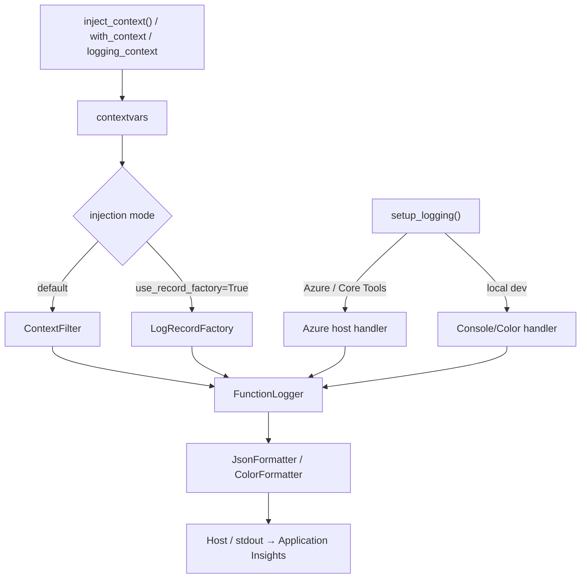

# Azure Functions Logging

> **Azure Functions Python DX Toolkit** 的一部分 — 由 [azure-functions-cookbook-python](https://github.com/yeongseon/azure-functions-cookbook-python) 通过自食其狗粮（dogfooding）方式验证。

[](https://pypi.org/project/azure-functions-logging/)
[](https://pypi.org/project/azure-functions-logging/)
[](https://github.com/yeongseon/azure-functions-logging-python/actions/workflows/ci-test.yml)
[](https://github.com/yeongseon/azure-functions-logging-python/actions/workflows/publish-pypi.yml)
[](https://github.com/yeongseon/azure-functions-logging-python/actions/workflows/security.yml)
[](https://codecov.io/gh/yeongseon/azure-functions-logging-python)
[](https://pre-commit.com/)
[](https://yeongseon.github.io/azure-functions-logging-python/)
[](LICENSE)

阅读其他语言版本: [English](README.md) | [한국어](README.ko.md) | [日本語](README.ja.md)

**面向 Azure Functions Python v2 的、感知调用（invocation-aware）的可观测性。**
暴露 `invocation_id`，检测冷启动，对 `host.json` 错误配置发出警告，并输出可直接用于 Application Insights 的结构化日志 — 不替换 Python 标准 `logging`。

---

**Azure Functions Python DX Toolkit** 的一部分
→ 为 Azure Functions 带来类似 FastAPI 的开发者体验。

## 为什么存在

Azure Functions Python 的日志记录有一些通用日志库无法处理的特定失败模式:

| 问题 | 发生现象 | 本库的解决方案 |
|------|---------|--------------|
| `host.json` 日志级别冲突 | `INFO` 日志在 Azure 中静默消失 | 在启动时检测并发出警告 |
| 日志中无 `invocation_id` | 无法将日志与特定执行关联 | 从 `context` 对象自动注入 |
| 冷启动不可见 | 新 worker 实例启动时无信号 | 在首次 `inject_context()` 时自动检测 |
| 嘈杂的第三方日志 | `azure-core`、`urllib3` 充斥 Application Insights | `SamplingFilter` / `RedactionFilter` |
| 本地与云端输出不匹配 | 彩色输出在生产管道中崩溃 | 环境感知的格式化器自动切换 |
| PII 泄露到日志 | 敏感值通过 extra 字段被意外记录 | 基于键的脱敏 `RedactionFilter` |

## 它做什么

- **调用上下文** — 自动将 `invocation_id`、`function_name`、`cold_start` 注入每条日志
- **结构化 JSON 输出** — 适用于 Application Insights 的 NDJSON 格式
- **噪声控制** — `SamplingFilter` 限制嘈杂第三方日志的速率
- **PII 保护** — `RedactionFilter` 在敏感字段到达日志聚合之前进行脱敏

> **范围免责声明。** 本包将结构化 JSON 写入 Python `logging` / stdout。这些字段在 Application Insights 中如何呈现取决于 Azure Functions host、worker、日志配置和 ingestion 管道。本库不拥有 ingestion 或 schema 映射 — `customDimensions` 解析形式和原始 `message` 形式在生产中都是有效的。

## 流水线一览



> 两种注入模式是**互斥的**：当 `use_record_factory=True` 时，请勿附加 `ContextFilter`。

## Before / After

**未使用** `azure-functions-logging` — 简单的 `print()` 输出，无上下文，无结构:

```python
import azure.functions as func

app = func.FunctionApp()


@app.route(route="orders")
def process_order(req: func.HttpRequest) -> func.HttpResponse:
    print("Processing order")        # 无 invocation_id, 无结构
    print(f"Order: {req.get_json()}")  # PII 可能泄露, 无日志级别
    return func.HttpResponse("OK")
```

终端输出:

```
Processing order
Order: {'customer': 'Alice', 'total': 99.99}
```

> 无 invocation ID。无日志级别。在 Application Insights 中难以关联。

**使用** `azure-functions-logging` — 结构化、可查询、生产就绪:

```python
import azure.functions as func

from azure_functions_logging import JsonFormatter, get_logger, logging_context, setup_logging

setup_logging(functions_formatter=JsonFormatter())
logger = get_logger(__name__)
app = func.FunctionApp()


@app.route(route="orders")
def process_order(req: func.HttpRequest, context: func.Context) -> func.HttpResponse:
    with logging_context(context):
        logger.info("Processing order", order_id="o-999")
        return func.HttpResponse("OK")
```

独立运行时 (如 `python app.py`，彩色格式化器) 的本地终端输出:

```
10:30:00 INFO     function_app  Processing order  [invocation_id=abc-123-def, function_name=process_order, cold_start=true]
```

在 `func start` / Azure 环境下的生产输出 (因为设置了 `functions_formatter`，适用于 Application Insights 的 NDJSON):

```json
{"timestamp": "2024-01-15T10:30:00+00:00", "level": "INFO", "logger": "function_app",
 "message": "Processing order", "invocation_id": "abc-123-def",
 "function_name": "process_order", "trace_id": null, "cold_start": true,
 "exception": null, "extra": {"order_id": "o-999"}}
```

> 每条日志都带有 `invocation_id` 和 `cold_start`。可在 Application Insights 中查询。零 `print()` 语句。

> **注意:** 确切的 Application Insights schema 取决于您的 ingestion 管道。在某些部署中，JSON 字段被解析为 `customDimensions`；在其他部署中，JSON 保留在 `message` 列中。下面提供了两种形式的示例。

### 在 Application Insights 中查询

#### 当 JSON 字段被解析为 `customDimensions` 时

```kql
traces
| where customDimensions.invocation_id == "abc-123-def"
| project timestamp, message, customDimensions.cold_start, customDimensions.function_name
| order by timestamp asc
```

查找过去 1 小时内的所有冷启动:

```kql
traces
| where customDimensions.cold_start == "true"
| where timestamp > ago(1h)
| summarize count() by bin(timestamp, 5m)
```

#### 当 JSON 保留在 `message` 列中时

```kql
traces
| extend payload = parse_json(message)
| where tostring(payload.invocation_id) == "abc-123-def"
| project timestamp, tostring(payload.message), tostring(payload.cold_start), tostring(payload.function_name)
| order by timestamp asc
```

查找过去 1 小时内的所有冷启动:

```kql
traces
| extend payload = parse_json(message)
| where tostring(payload.cold_start) == "true"
| where timestamp > ago(1h)
| summarize count() by bin(timestamp, 5m)
```

## 本包不做什么

本包不拥有:

- **替换 stdlib logging** — 它包装并丰富 Python 标准 `logging`，从不替换它
- **分布式追踪** — 端到端追踪关联请使用 OpenTelemetry 或 Application Insights SDK
- **API 文档** — API 文档和 spec 生成请使用 [`azure-functions-openapi`](https://github.com/yeongseon/azure-functions-openapi-python)

## 安装

```bash
pip install azure-functions-logging
```

## Quick Start

```python
import azure.functions as func
from azure_functions_logging import get_logger, logging_context, setup_logging

setup_logging()
logger = get_logger(__name__)

app = func.FunctionApp()

@app.route(route="hello")
def hello(req: func.HttpRequest, context: func.Context) -> func.HttpResponse:
    with logging_context(context):  # 绑定 invocation_id, function_name, cold_start; 退出时恢复先前上下文
        logger.info("Request received")
        # 日志记录现在携带 invocation_id、function_name、cold_start

        return func.HttpResponse("OK")
```

`logging_context` 是推荐的主要模式: 在进入时注入上下文，并在退出时 **始终** 恢复先前的上下文 (即使处理程序抛出异常)，这可以防止陈旧的上下文在重用 worker 时泄漏到下一次调用。

如需较低级别的控制或与自定义中间件集成，请使用基于令牌 (token) 的恢复:

```python
from azure_functions_logging import inject_context, restore_context

# 假设 `logger` 和 `context` 已在作用域内 (参见 Quick Start)。
tokens = inject_context(context)
try:
    logger.info("Request received")
finally:
    restore_context(tokens)
```

仅当您有意清除所有上下文时 (例如测试 teardown)，才使用 `reset_context()`。

在本地启动 Functions host (使用 [e2e 示例应用](examples/e2e_app)):

```bash
func start --script-root examples/e2e_app
```

### 在本地与 Azure 上验证

部署后 (参见 [docs/deployment.md](docs/deployment.md))，相同的请求在两个环境中产生相同的响应。

#### 本地

```bash
curl -s http://localhost:7071/api/logme?correlation_id=demo-123
```

```json
{"logged": true, "correlation_id": "demo-123"}
```

#### Azure

```bash
curl -s "https://<your-app>.azurewebsites.net/api/logme?correlation_id=demo-123"
```

```json
{"logged": true, "correlation_id": "demo-123"}
```

> 已在 koreacentral 区域的临时 Azure Functions 部署上验证 (Python 3.12, Consumption plan)。已捕获响应，并对 URL 进行匿名化。

## 调用上下文 (Invocation Context)

使用 `logging_context()` 在处理程序运行期间绑定调用上下文。它会设置:

- `invocation_id` — 每次执行唯一，关联一个请求的所有日志
- `function_name` — Azure Functions 函数名
- `trace_id` — 来自平台的 trace 上下文；仅从有效的 W3C `traceparent` 头中提取（严格校验，无效值会被忽略）
- `cold_start` — 此 worker 进程的首次调用时为 `True`

> **`cold_start` 语义。** `cold_start=True` 表示 *模块加载后此 Python worker 进程观察到的首次调用*。它**不是**平台级别的冷启动指标，与 Azure Functions 指标报告的 App Service plan / instance 分配冷启动不对应。在同一 worker 上的后续调用，在 worker 被回收之前会发出 `cold_start=False`。

```python
def my_function(req, context):
    with logging_context(context):
        logger.info("handler started")
        # 从此处开始的每条日志都带有 invocation_id 和 cold_start
```

如需较低级别的控制 (例如中间件)，请使用 `inject_context()` 配合 `restore_context()`:

```python
tokens = inject_context(context)
try:
    logger.info("handler started")
finally:
    restore_context(tokens)
```

不进行上下文注入时，每条日志中这些字段都为 `None`。

### `with_context` 装饰器

为减少样板代码，可使用 `with_context` 装饰器代替手动调用 `inject_context()`:

```python
import azure.functions as func
from azure_functions_logging import get_logger, setup_logging, with_context

setup_logging()
logger = get_logger(__name__)

app = func.FunctionApp()

@app.route(route="hello")
@with_context
def hello(req: func.HttpRequest, context: func.Context) -> func.HttpResponse:
    logger.info("Request received")
    return func.HttpResponse("OK")
```

装饰器按名称查找 `context` 参数，在处理程序运行前调用 `inject_context()`，并在返回后的 `finally` 中恢复先前上下文。

自定义参数名:

```python
@with_context(param="ctx")
def hello(req: func.HttpRequest, ctx: func.Context) -> func.HttpResponse:
    ...
```

支持同步与异步处理程序。

### 全局 LogRecordFactory (opt-in)

对于在 `setup_logging()` 之后可能添加处理程序的应用，或希望无论处理程序/过滤器如何配置都让 **每个** `LogRecord` 都带有调用上下文的应用，请在启动时安装一次全局上下文工厂:

```python
from azure_functions_logging import install_context_factory, setup_logging

install_context_factory()  # 在记录创建时注入上下文
setup_logging()
```

启用后，`invocation_id`、`function_name`、`trace_id` 和 `cold_start` 将成为保留的 `LogRecord` 属性。通过 stdlib `extra=` 传递它们将引发 `KeyError`。请使用 `FunctionLogger` (它会自动清理键名) 或选择不同的键名。

> **与 `setup_logging()` 的关系:** 当 `use_record_factory=False` (默认値) 时，`setup_logging()` 会在处理程序上安装 `ContextFilter`。两者可以同时调用 — 它们设置相同的値，因此不会冲突。`install_context_factory()` 确保在稍后添加的处理程序或绕过过滤器链的 logger 上也能覆盖。
>
> 当 `use_record_factory=True` 时，`setup_logging()` 切换到工厂模式: 先从现有 root 处理程序中删除所有 `ContextFilter` 实例，然后注册 `LogRecordFactory`。这样可以防止重复注入，同时确保所有记录都携带上下文。
## 结构化 JSON 输出 (生产)

当日志流向 Application Insights 或任何聚合系统时，请使用 JSON 格式:

> **注意:** `format` 参数仅影响本库创建的处理程序 (本地开发)。
> 在 Azure Functions 中，host 管理处理程序。要在 host 管理的处理程序上设置 JSON 输出，请使用
> `functions_formatter=JsonFormatter()`。在 Azure 中传递 `format="json"` 会发出警告。

对于独立的本地开发或 CI 输出:

```python
setup_logging(format="json")
```

对于 Azure Functions / Core Tools，host 拥有处理程序。要在现有的 host 管理处理程序上强制使用 JSON 格式:

```python
from azure_functions_logging import JsonFormatter, setup_logging

setup_logging(functions_formatter=JsonFormatter())
```

每行日志输出 (NDJSON — 每行一个 JSON 对象):

```json
{"timestamp": "2024-01-15T10:30:00+00:00", "level": "INFO", "logger": "my_module",
 "message": "order accepted", "invocation_id": "abc-123", "function_name": "OrderHandler",
 "cold_start": false, "trace_id": "4bf92f3577b34da6a3ce929d0e0e4736", "exception": null,
 "extra": {"order_id": "o-999"}}
```

额外字段出现在发出的 JSON 的 `extra` 中。在 Application Insights 中是否可直接索引取决于您的 ingestion 管道: 当 JSON 被解析为 `customDimensions` 时可直接查询；当 JSON 保留在 `message` 列中时，需要先使用 `parse_json(message)`。

```python
logger.info("order accepted", order_id="o-999", tenant_id="t-1")
```

### 裁剪长字符串値 (opt-in)

默认情况下，`JsonFormatter` 对 `extra` 中的字符串値保持完整长度。
传入 `truncate_native_strings=True` 可将它们裁剪到 `max_string_length` 个字符 (默认 2048)。
被裁剪的字符串会以 `…` 后缀结尾，使调用者可以检测到裁剪:

```python
from azure_functions_logging import JsonFormatter, setup_logging

setup_logging(functions_formatter=JsonFormatter(
    truncate_native_strings=True,
    max_string_length=512,
))
```

> **范围:** 仅裁剪 `extra` 中的字符串値 (递归遍历 dict 和 list)。
> `message` 字段、整数、浮点数和布尔子不受影响。

```python
logger.info("order accepted", order_id="o-999", tenant_id="t-1")
```

## host.json 冲突检测

如果您的 `host.json` 抑制了应用发出的日志级别，启动时会出现以下警告:

```
host.json logLevel for default is set to 'Warning' which is more restrictive than the configured level 'INFO'. Logs below 'Warning' will be suppressed by the Azure Functions host.
```

推荐的 `host.json` 基线:

```json
{
  "version": "2.0",
  "logging": {
    "logLevel": {
      "default": "Information",
      "Function": "Information"
    }
  }
}
```

### 发现顺序

`host.json` 通过从当前工作目录 (或 `AzureWebJobsScriptRoot` 环境变量指向的目录) 向上遍历来定位:

| 优先级 | 来源 |
|--------|------|
| 1 | 传入 `setup_logging()` 的显式 `host_json_path` 参数 |
| 2 | `AzureWebJobsScriptRoot` 环境变量 |
| 3 | `cwd/host.json` 及各父目录，最多 5 层 |

第一个存在的 `host.json` 被采用。`AzureWebJobsScriptRoot` 是 Azure Functions 主机设置的官方环境变量，仅探测该目录本身 (不进行祖先遍历)。

第一个存在的文件被采用。要绕过自动发现 (例如在测试或非标准布局中)，请传递显式路径:

```python
from pathlib import Path
from azure_functions_logging import setup_logging

setup_logging(host_json_path=Path("/site/wwwroot/host.json"))
```

## 噪声控制

在不删除嘈杂第三方 logger 的情况下抑制它们:

```python
from azure_functions_logging import SamplingFilter, setup_logging
import logging

setup_logging()

# 对吵闹的 azure.* logger 进行采样: 每 1 秒窗口保留最多 10 条记录
# 附加到 logger 的过滤器不会对从子 logger 传播的记录运行，
# 所以附加到根处理程序并按 logger 名称限定范围。
for handler in logging.getLogger().handlers:
    handler.addFilter(SamplingFilter(rate=10, name="azure"))

# 在生产环境完全静默 urllib3
logging.getLogger("urllib3").setLevel(logging.WARNING)
```

## PII Redaction

在敏感字段到达 Application Insights 之前剥离它们:

```python
from azure_functions_logging import RedactionFilter, setup_logging
import logging

setup_logging()
root = logging.getLogger()
# 将过滤器附加到处理程序，以便命名子 logger 的记录也被脱敏。
for handler in root.handlers:
    handler.addFilter(RedactionFilter(sensitive_keys=["password", "token", "secret"]))
```

extra 字段中键名匹配 sensitive 键的任何日志记录将其值替换为 `***`。

## 本地 vs 云端

| 环境 | 格式 | 行为 |
|------|------|------|
| 本地终端 | `color` (默认) | 彩色人类可读格式: `HH:MM:SS LEVEL logger  message [context...]` |
| Azure / Core Tools | host-managed | 仅安装上下文过滤器；通过 `functions_formatter=JsonFormatter()` 在 host 处理程序上强制 NDJSON |
| CI / 管道 | `json` | NDJSON, 机器可解析 |

`setup_logging()` 检测 `FUNCTIONS_WORKER_RUNTIME` 以区分 Azure Functions / Core Tools 与本地独立运行。在 Azure 模式下，它不添加处理程序仅安装上下文过滤器（避免来自 host 管道的重复输出）。

## 上下文绑定

将请求范围的元数据附加到每条日志，而无需在每次调用中传递它:

```python
def process_order(order_id: str) -> None:
    order_logger = logger.bind(order_id=order_id, region="eastus")
    order_logger.info("processing started")   # 包含 order_id + region
    order_logger.info("processing complete")  # 相同元数据，新消息
```

按调用创建绑定的 logger。不要在模块级别缓存它们。

## 何时使用

- 您需要在 Application Insights 中获得结构化、可查询的日志时
- 您希望对单个请求的所有日志进行 `invocation_id` 关联时
- 您需要无需自定义 instrumentation 的冷启动检测时
- 您希望对第三方 logger 进行 PII redaction 或噪声控制时
- 您的 `host.json` 配置静默抑制日志而您不知道原因时

## 文档

- 完整文档: [yeongseon.github.io/azure-functions-logging-python](https://yeongseon.github.io/azure-functions-logging-python/)
- [Configuration reference](https://yeongseon.github.io/azure-functions-logging-python/configuration/)
- [Troubleshooting guide](https://yeongseon.github.io/azure-functions-logging-python/troubleshooting/)
- [API reference](https://yeongseon.github.io/azure-functions-logging-python/api/)

## 生态系统

本包是 **Azure Functions Python DX Toolkit** 的一部分。

**设计原则:** `azure-functions-logging` 拥有结构化日志和调用感知的可观测性。它丰富 Python 的标准 `logging` — 不替换它。相邻关注点属于 [`azure-functions-openapi`](https://github.com/yeongseon/azure-functions-openapi-python) (API 文档与 spec 生成)、[`azure-functions-validation`](https://github.com/yeongseon/azure-functions-validation-python) (请求/响应验证与序列化) 以及 [`azure-functions-langgraph`](https://github.com/yeongseon/azure-functions-langgraph-python) (LangGraph 运行时暴露)。

| 包 | 角色 |
|----|------|
| [azure-functions-openapi-python](https://github.com/yeongseon/azure-functions-openapi-python) | OpenAPI spec 生成与 Swagger UI |
| [azure-functions-validation-python](https://github.com/yeongseon/azure-functions-validation-python) | 请求/响应验证与序列化 |
| [azure-functions-db-python](https://github.com/yeongseon/azure-functions-db-python) | 适用于 SQL、PostgreSQL、MySQL、SQLite 和 Cosmos DB 的数据库绑定 |
| [azure-functions-langgraph-python](https://github.com/yeongseon/azure-functions-langgraph-python) | Azure Functions 的 LangGraph 部署适配器 |
| [azure-functions-scaffold-python](https://github.com/yeongseon/azure-functions-scaffold-python) | 项目脚手架 CLI |
| **azure-functions-logging-python** | 结构化日志与可观测性 |
| [azure-functions-doctor-python](https://github.com/yeongseon/azure-functions-doctor-python) | 部署前诊断 CLI |
| [azure-functions-durable-graph-python](https://github.com/yeongseon/azure-functions-durable-graph-python) | 基于 Durable Functions 的清单优先 (manifest-first) 图运行时 *(experimental)* |
| [azure-functions-knowledge-python](https://github.com/yeongseon/azure-functions-knowledge-python) | 知识检索 (RAG) 装饰器 |
| [azure-functions-cookbook-python](https://github.com/yeongseon/azure-functions-cookbook-python) | 自食狗粮示例 — 演练完整 toolkit 的可运行配方 |


## 给 AI 编码助手的说明

本包为 Azure Functions 提供结构化日志，对 stdlib logging 零修改。

**LLM 友好资源:**
- `llms.txt` — 简洁的 API 参考与 quick start (仓库根目录)
- `llms-full.txt` — 完整的 API 签名、模式与设计原则 (仓库根目录)

**代码生成的关键实现细节:**

1. **保留 host 配置** — 在 Azure / Core Tools 中不添加处理程序，root logger 级别交给 `host.json`；在已有 root 处理程序以及 root logger 自身上安装 `ContextFilter`（以便在 root logger 上的直接调用携带上下文）。若需覆盖从命名子 logger 传播到后续添加处理程序的记录，请调用 `install_context_factory()` 以保证上下文覆盖。在本地独立模式下，`setup_logging(logger_name=None)` 会配置 root logger（设置级别，无处理程序时添加 `StreamHandler`）。
2. **上下文注入基于 contextvar** — 不是 thread-local，与 asyncio 协同工作
3. **幂等 setup** — 多次调用 `setup_logging()` 是安全的
4. **两个环境，两种行为**:
   - Azure/Core Tools: 在现有 root 处理程序以及 root logger 自身上安装 `ContextFilter`；不添加处理程序，也不修改 root 级别（尊重 `host.json`）。
   - 本地独立运行: 设置目标/根 logger 级别；**仅当不存在任何处理程序时**添加 `StreamHandler`（ColorFormatter 或 JsonFormatter），否则仅在现有处理程序上附加过滤器。
5. **测试友好**:
   - `inject_context()` 接受任何对象 (对 azure.functions.Context 没有强依赖)
   - `with_context` 装饰器在同步与异步处理程序中都有效
   - 如需要，可在测试 teardown 中使用 `reset_context()`

**生成代码时:**
- 仅从 `azure_functions_logging` 公共 API 导入 (无下划线)
- 在模块级别或处理程序启动时调用 `setup_logging()` (而不是每次请求)
- 在处理程序中优先使用 `with logging_context(context):`; 仅在配合 `try/finally restore_context(tokens)` 时使用原始 `inject_context(context)`
- 对每次请求的字段使用 `logger.bind(key=value)` (而不是直接 logger.extra)
- 如需隐式按处理程序注入上下文，可使用 `with_context` 装饰器
- 调用 `get_logging_metadata(func)` 检查函数的 `@with_context` 元数据 (返回 `dict[str, Any] | None`)
- 对 PII 字段应用 `RedactionFilter`，对高频日志应用 `SamplingFilter`

**示例模式:**
```python
from azure_functions_logging import get_logger, logging_context, setup_logging

# 模块级
setup_logging()
logger = get_logger(__name__)

# 每个处理程序
def my_function(req: func.HttpRequest, context: func.Context) -> func.HttpResponse:
    with logging_context(context):
        req_logger = logger.bind(correlation_id=req.params.get("id"))
        req_logger.info("Processing")
        return func.HttpResponse("OK")
```


本项目是独立的社区项目，与 Microsoft 没有关联，也未获得 Microsoft 的认可或维护。

Azure 和 Azure Functions 是 Microsoft Corporation 的商标。

## 许可证

MIT
