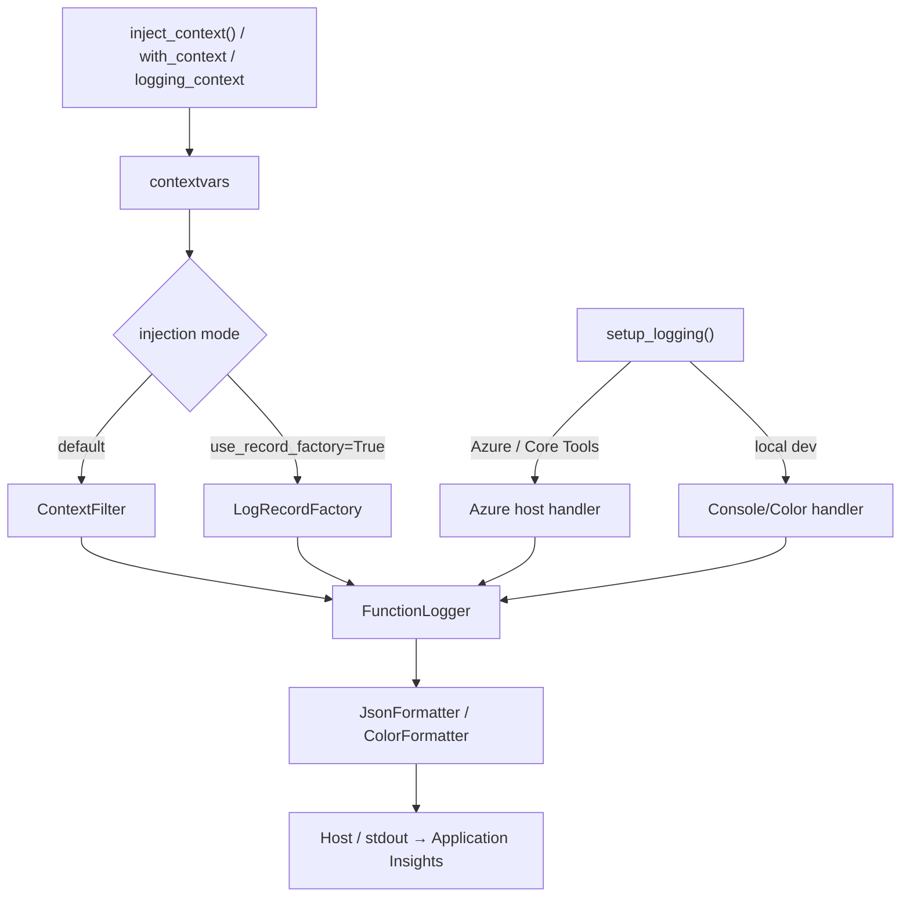

# Azure Functions Logging

> **Azure Functions Python DX Toolkit** 的一部分 — 由 [azure-functions-cookbook-python](https://github.com/yeongseon/azure-functions-cookbook-python) 通过自食其狗粮（dogfooding）方式验证。

[](https://pypi.org/project/azure-functions-logging/)
[](https://pepy.tech/project/azure-functions-logging)
[](https://pypi.org/project/azure-functions-logging/)
[](https://github.com/yeongseon/azure-functions-logging-python/actions/workflows/ci-test.yml)
[](https://github.com/yeongseon/azure-functions-logging-python/actions/workflows/publish-pypi.yml)
[](https://github.com/yeongseon/azure-functions-logging-python/actions/workflows/security.yml)
[](https://codecov.io/gh/yeongseon/azure-functions-logging-python)
[](https://pre-commit.com/)
[](https://yeongseon.dev/azure-functions-python/logging/)
[](LICENSE)

阅读其他语言版本: [English](README.md) | [한국어](README.ko.md) | [日本語](README.ja.md)

> ℹ️ 本翻译由社区维护，仅供参考，可能落后于最新的 [English README](README.md)。请以英文版为准。

**面向 Azure Functions Python v2 的、感知调用（invocation-aware）的可观测性。**
暴露 `invocation_id`，检测冷启动，对 `host.json` 错误配置发出警告，并输出可直接用于 Application Insights 的结构化日志 — 不替换 Python 标准 `logging`。

---

**Azure Functions Python DX Toolkit** 的一部分
→ 为 Azure Functions 带来类似 FastAPI 的开发者体验。

## 为什么存在

Azure Functions Python 的日志记录有一些通用日志库无法处理的特定失败模式:

| 问题 | 发生现象 | 本库的解决方案 |
|------|---------|--------------|
| `host.json` 日志级别冲突 | `INFO` 日志在 Azure 中静默消失 | 在启动时检测并发出警告 |
| 日志中无 `invocation_id` | 无法将日志与特定执行关联 | 从 `context` 对象自动注入 |
| 冷启动不可见 | 新 worker 实例启动时无信号 | 在首次 `inject_context()` 时自动检测 |
| 嘈杂的第三方日志 | `azure-core`、`urllib3` 充斥 Application Insights | `SamplingFilter` / `RedactionFilter` |
| 本地与云端输出不匹配 | 彩色输出在生产管道中崩溃 | 环境感知的格式化器自动切换 |
| PII 泄露到日志 | 敏感值通过 extra 字段被意外记录 | 基于键的脱敏 `RedactionFilter` |
| 日志与调用追踪脱离 | Python 是唯一没有内置 OpenTelemetry 调用中间件的 Functions worker 运行时，除非你在每个处理器中自行激活 span，否则 worker 日志记录会携带 `span_id=0` 而被脱离 | 绑定 host 的 W3C trace context，使 OpenTelemetry 日志继承调用的 `trace_id` / `span_id` |

## 它做什么

- **调用上下文** — 自动将 `invocation_id`、`function_name`、`cold_start`、`host_instance_id`（横向扩展的工作实例）注入每条日志
- **结构化 JSON 输出** — 适用于 Application Insights 的 NDJSON 格式
- **噪声控制** — `SamplingFilter` 限制嘈杂第三方日志的速率
- **PII 保护** — `RedactionFilter` 在敏感字段到达日志聚合之前进行脱敏

> **范围免责声明。** 本包将结构化 JSON 写入 Python `logging` / stdout。这些字段在 Application Insights 中如何呈现取决于 Azure Functions host、worker、日志配置和 ingestion 管道。本库不拥有 ingestion 或 schema 映射 — `customDimensions` 解析形式和原始 `message` 形式在生产中都是有效的。

## OpenTelemetry 追踪关联

> **Python 是唯一没有内置 OpenTelemetry 调用中间件的 Azure Functions worker 运行时。** host 为每次调用发出 W3C `traceparent`，但 Python worker 从不在进程内激活它 — 因此除非你自行激活 span，否则 worker 日志记录会被标记为 `span_id=0`，并与 host 的调用 span 脱离。

你 *可以* 手动弥补这个缺口，但这是手工操作且容易遗忘。structlog、Loguru 和 stdlib `logging` 都依靠 OpenTelemetry 的 `LoggingHandler` / `LoggingInstrumentor`，它们只有在进程中 **存在活动 span 时** 才会附加 `trace_id` / `span_id`。由于 Python worker 从不激活 span，Microsoft 文档化的模式是提取 host 的 `traceparent` 并在 **每个处理器中** 自行启动 span。只要在一个路径中遗漏，那些记录就会静默地回退到 `span_id=0`。

`azure-functions-logging` 弥补了这个缺口。通过 `activate_trace_context=True`（需要 `[otel]` extra）选择开启，库会在处理器运行期间绑定 host 的 W3C trace context，使你现有的 OpenTelemetry 日志记录继承调用的 `trace_id` / `span_id`：

```python
from azure_functions_logging import logging_context, setup_logging

setup_logging(activate_trace_context=True)  # 需要: pip install azure-functions-logging[otel]

with logging_context(context):
    logger.info("processing")  # OpenTelemetry 记录继承调用的 trace_id / span_id
```

这是 **关联，而非追踪** — 库从不创建、记录或导出 span。它补充而非替代 OpenTelemetry 或 Application Insights SDK，后者仍负责产生 span。参见 [OpenTelemetry 追踪关联指南](https://yeongseon.dev/azure-functions-python/logging/opentelemetry/)。

更倾向于按调用激活？跳过进程级默认设置，直接传入：`with logging_context(context, activate_trace_context=True):`。


## 流水线一览



> 两种注入模式是**互斥的**：当 `use_record_factory=True` 时，请勿附加 `ContextFilter`。

## Before / After

**未使用** `azure-functions-logging` — 简单的 `print()` 输出，无上下文，无结构:

```python
import azure.functions as func

app = func.FunctionApp()


@app.route(route="orders")
def process_order(req: func.HttpRequest) -> func.HttpResponse:
    print("Processing order")        # 无 invocation_id, 无结构
    print(f"Order: {req.get_json()}")  # PII 可能泄露, 无日志级别
    return func.HttpResponse("OK")
```

终端输出:

```
Processing order
Order: {'customer': 'Alice', 'total': 99.99}
```

> 无 invocation ID。无日志级别。在 Application Insights 中难以关联。

**使用** `azure-functions-logging` — 结构化、可查询、生产就绪:

```python
import azure.functions as func

from azure_functions_logging import JsonFormatter, get_logger, logging_context, setup_logging

setup_logging(functions_formatter=JsonFormatter())
logger = get_logger(__name__)
app = func.FunctionApp()


@app.route(route="orders")
def process_order(req: func.HttpRequest, context: func.Context) -> func.HttpResponse:
    with logging_context(context):
        logger.info("Processing order", order_id="o-999")
        return func.HttpResponse("OK")
```

独立运行时 (如 `python app.py`，彩色格式化器) 的本地终端输出:

```
10:30:00 INFO     function_app  Processing order  [invocation_id=abc-123-def, function_name=process_order, cold_start=true]
```

在 `func start` / Azure 环境下的生产输出 (因为设置了 `functions_formatter`，适用于 Application Insights 的 NDJSON):

```json
{"timestamp": "2024-01-15T10:30:00+00:00", "level": "INFO", "logger": "function_app",
 "message": "Processing order", "invocation_id": "abc-123-def",
 "function_name": "process_order", "trace_id": null, "cold_start": true,
 "host_instance_id": "0d1f2a3b4c5d",
 "exception": null, "extra": {"order_id": "o-999"}}
```

> 每条日志都带有 `invocation_id` 和 `cold_start`。可在 Application Insights 中查询。零 `print()` 语句。

> **注意:** 确切的 Application Insights schema 取决于您的 ingestion 管道。在某些部署中，JSON 字段被解析为 `customDimensions`；在其他部署中，JSON 保留在 `message` 列中。下面提供了两种形式的示例。

### 在 Application Insights 中查询

#### 当 JSON 字段被解析为 `customDimensions` 时

```kql
traces
| where customDimensions.invocation_id == "abc-123-def"
| project timestamp, message, customDimensions.cold_start, customDimensions.function_name
| order by timestamp asc
```

查找过去 1 小时内的所有冷启动:

```kql
traces
| where customDimensions.cold_start == "true"
| where timestamp > ago(1h)
| summarize count() by bin(timestamp, 5m)
```

#### 当 JSON 保留在 `message` 列中时

```kql
traces
| extend payload = parse_json(message)
| where tostring(payload.invocation_id) == "abc-123-def"
| project timestamp, tostring(payload.message), tostring(payload.cold_start), tostring(payload.function_name)
| order by timestamp asc
```

查找过去 1 小时内的所有冷启动:

```kql
traces
| extend payload = parse_json(message)
| where tostring(payload.cold_start) == "true"
| where timestamp > ago(1h)
| summarize count() by bin(timestamp, 5m)
```

## 本包不做什么

本包不拥有:

- **替换 stdlib logging** — 它包装并丰富 Python 标准 `logging`，从不替换它
- **分布式追踪** — 它会**绑定** Azure Functions 主机的 W3C 追踪上下文，使你已有的 OpenTelemetry 日志记录继承调用 span 的 `trace_id` / `span_id`，但它自身绝不创建、记录或导出 span —— 是关联（correlation）而非追踪。请使用 OpenTelemetry 或 Application Insights SDK 来生成 span。参见 [OpenTelemetry 追踪关联](https://yeongseon.dev/azure-functions-python/logging/opentelemetry/)
- **API 文档** — API 文档和 spec 生成请使用 [`azure-functions-openapi`](https://github.com/yeongseon/azure-functions-openapi-python)

## 安装

```bash
pip install azure-functions-logging
```

## Quick Start

```python
import azure.functions as func
from azure_functions_logging import get_logger, logging_context, setup_logging

setup_logging()
logger = get_logger(__name__)

app = func.FunctionApp()

@app.route(route="hello")
def hello(req: func.HttpRequest, context: func.Context) -> func.HttpResponse:
    with logging_context(context):  # 绑定 invocation_id, function_name, cold_start; 退出时恢复先前上下文
        logger.info("Request received")
        # 日志记录现在携带 invocation_id、function_name、cold_start

        return func.HttpResponse("OK")
```

`logging_context` 是推荐的主要模式: 在进入时注入上下文，并在退出时 **始终** 恢复先前的上下文 (即使处理程序抛出异常)，这可以防止陈旧的上下文在重用 worker 时泄漏到下一次调用。

如需较低级别的控制或与自定义中间件集成，请使用基于令牌 (token) 的恢复:

```python
from azure_functions_logging import inject_context, restore_context

# 假设 `logger` 和 `context` 已在作用域内 (参见 Quick Start)。
tokens = inject_context(context)
try:
    logger.info("Request received")
finally:
    restore_context(tokens)
```

仅当您有意清除所有上下文时 (例如测试 teardown)，才使用 `reset_context()`。

在本地启动 Functions host (使用 [e2e 示例应用](examples/e2e_app)):

```bash
func start --script-root examples/e2e_app
```

### 在本地与 Azure 上验证

部署后 (参见 [docs/deployment.md](docs/deployment.md))，相同的请求在两个环境中产生相同的响应。

#### 本地

```bash
curl -s http://localhost:7071/api/logme?correlation_id=demo-123
```

```json
{"logged": true, "correlation_id": "demo-123"}
```

#### Azure

```bash
curl -s "https://<your-app>.azurewebsites.net/api/logme?correlation_id=demo-123"
```

```json
{"logged": true, "correlation_id": "demo-123"}
```

> 已在 koreacentral 区域的临时 Azure Functions 部署上验证 (Python 3.12, Consumption plan)。已捕获响应，并对 URL 进行匿名化。

## 核心功能

下面每一项能力在[文档站点](https://yeongseon.dev/azure-functions-python/logging/)上都有完整的操作指南 —— 本节只概述每项能力的作用并链接到唯一来源，从而让 README 保持为快速概览，而不是文档的第二份副本。

### 调用上下文

`logging_context(context)`（参见 [Quick Start](#quick-start)）在处理函数执行期间绑定 `invocation_id`、`function_name`、`trace_id` 和 `cold_start`，并始终在退出时恢复先前的上下文。如需更底层的控制，可使用 `inject_context()` / `restore_context()`，或使用 `@with_context` 装饰器隐式注入（支持同步和异步处理函数）。

> **`cold_start` 语义。** `cold_start=True` 表示本 Python worker 进程在模块加载后观察到的首次调用 —— **并非**平台级别的冷启动指标。

> **工作实例。** 每条记录还携带 `host_instance_id`，这是产生该日志的工作实例的尽力而为的标识符（按 `WEBSITE_INSTANCE_ID` → `WEBSITE_POD_NAME` → `CONTAINER_NAME` → `socket.gethostname()` 的顺序解析）。它是 Application Insights 的 `cloud_RoleInstance` 的补充，但不保证与其完全一致。

→ [Usage: context injection](https://yeongseon.dev/azure-functions-python/logging/usage/#3-context-injection-in-azure-functions) · [API: `with_context`](https://yeongseon.dev/azure-functions-python/logging/api/#with_context)

### 结构化 JSON 输出

传入 `setup_logging(functions_formatter=JsonFormatter())`，即可在宿主托管的 handler 上输出可直接用于 Application Insights 的 NDJSON（或用 `format="json"` 用于独立/CI 场景）。额外字段会归入 `extra`；可选择开启 `truncate_native_strings=True` 以裁剪过长的字符串值。

→ [Usage: JSON output](https://yeongseon.dev/azure-functions-python/logging/usage/#2-json-output-for-production) · [API: `JsonFormatter`](https://yeongseon.dev/azure-functions-python/logging/api/#jsonformatter)

### host.json 冲突检测

启动时，当你的 `host.json` —— 或 `AzureFunctionsJobHost__logging__logLevel__...` 应用设置覆盖 —— 抑制了应用实际发出的日志级别时，本库会发出警告。`host.json` 会从工作目录（或 `AzureWebJobsScriptRoot`）向上遍历自动发现；可传入 `host_json_path=` 覆盖。

→ [Configuration: host.json conflict](https://yeongseon.dev/azure-functions-python/logging/configuration/#hostjson-level-conflict-warning) · [Troubleshooting](https://yeongseon.dev/azure-functions-python/logging/troubleshooting/#hostjson-conflict-warning-appears)

### 噪声控制与 PII 脱敏

`SamplingFilter` 对话痨式的第三方 logger（如 `azure-core`、`urllib3`）进行限流；`RedactionFilter` 在日志到达聚合之前对敏感键（密码、令牌、密钥、连接字符串等 —— 不区分大小写、递归）进行掩码。将两者中的任意一个附加到根 handler，并可传入 `sensitive_keys=[...]` 自定义脱敏。

→ [API: `SamplingFilter`](https://yeongseon.dev/azure-functions-python/logging/api/#samplingfilter) · [API: `RedactionFilter`](https://yeongseon.dev/azure-functions-python/logging/api/#redactionfilter)

### 上下文绑定

`logger.bind(key=value)` 返回一个 logger，它会把请求作用域的元数据附加到之后的每一条日志上，而无需逐次调用传递。请按调用创建绑定的 logger；不要在模块级别缓存它们。

→ [Usage: context binding](https://yeongseon.dev/azure-functions-python/logging/usage/#4-context-binding-with-functionloggerbind)

### 全局 LogRecordFactory（可选启用）


`setup_logging(use_record_factory=True)` 会安装一个全局 `LogRecordFactory`，在记录创建时注入上下文，因此**每一条** `LogRecord` 都会携带上下文，而不受 handler/filter 接线方式的影响 —— 当 handler 在 `setup_logging()` 之后才添加，或 logger 绕过 filter 链时尤其有用。它与默认的 `ContextFilter` 模式互斥。

→ [Configuration: `use_record_factory`](https://yeongseon.dev/azure-functions-python/logging/configuration/#parameter-use_record_factory)

### 本地 vs 云端

`setup_logging()` 会检测 `FUNCTIONS_WORKER_RUNTIME`：本地输出彩色可读格式，在 Azure / Core Tools 中输出宿主托管的 NDJSON（仅 context filter —— 不添加重复 handler），在 CI 中输出机器可解析的 JSON。

→ [Configuration: environment detection](https://yeongseon.dev/azure-functions-python/logging/configuration/#environment-detection)
## 何时使用

- 您需要在 Application Insights 中获得结构化、可查询的日志时
- 您希望对单个请求的所有日志进行 `invocation_id` 关联时
- 您需要无需自定义 instrumentation 的冷启动检测时
- 您希望对第三方 logger 进行 PII redaction 或噪声控制时
- 您的 `host.json` 配置静默抑制日志而您不知道原因时

## 症状 → 修复

带着症状而非功能名称前来？从这里开始。每个条目列出最小设置、结果日志**能证明什么**，以及同样重要的**不能证明什么**。

<details>
<summary><strong>我的 <code>INFO</code> 日志在 Azure 中不可见</strong></summary>

**可能原因：** 某个 `host.json` 日志级别（或 `AzureFunctionsJobHost__logging__logLevel__...` 应用设置）正在抑制应用输出的级别。

```python
setup_logging()  # 若 host.json 抑制了你输出的级别，启动时会警告
```

**你会看到：** 一条命名冲突级别的启动警告。**证明：** 你配置的级别正在丢弃记录。**不能证明：** 该记录是否真的到达了 Application Insights ingestion — 那是另一个独立的管道问题。

→ [host.json 冲突检测](#hostjson-冲突检测)
</details>

<details>
<summary><strong>不同调用的日志交织在一起</strong></summary>

```python
with logging_context(context):
    logger.info("Processing order")
```

现在每条记录都带有 `invocation_id`。按它过滤（参见[在 Application Insights 中查询](#在-application-insights-中查询)）即可隔离单次执行。**证明：** 哪些记录属于同一次调用。**不能证明：** worker 之间的顺序 — 时间戳是按进程的。

→ [调用上下文](#调用上下文)
</details>

<details>
<summary><strong>我想知道是不是只有第一次请求慢</strong></summary>

每条记录都带有 `cold_start`。要查找首次调用的记录，请按与你的 ingestion 管道匹配的形式查询 — 当 JSON 保留在 `message` 中时用 `tostring(payload.cold_start) == "true"`，当字段被提升时用 `customDimensions.cold_start == "true"`（参见[在 Application Insights 中查询](#在-application-insights-中查询)）。

> **注意：** `cold_start=True` 指模块加载后 *此 Python worker 进程* 观察到的首次调用 — **而非**平台级的 cold-start 指标。它不衡量首次受控调用之前的 host 分配或 worker 启动时间。

→ [调用上下文](#调用上下文)
</details>

<details>
<summary><strong>哪个 worker 实例产生了这个错误？</strong></summary>

每条记录都带有 `host_instance_id`，这是产生日志的 worker 实例的 best-effort 标识符（按 `WEBSITE_INSTANCE_ID` → `WEBSITE_POD_NAME` → `CONTAINER_NAME` → `socket.gethostname()` 解析）。**证明：** 具有相同 instance id 的记录来自同一 worker。**不能证明：** 与 Application Insights 的 `cloud_RoleInstance` 相等 — 它是互补的，不保证完全一致。

→ [调用上下文](#调用上下文)
</details>

<details>
<summary><strong>Azure SDK / 第三方日志器太嗧</strong></summary>

```python
import logging

from azure_functions_logging import SamplingFilter

logging.getLogger("azure.core.pipeline.policies.http_logging_policy").addFilter(SamplingFilter(rate=10))  # 每秒最多保留 10 条记录
```

`SamplingFilter` 在嗧闹日志器到达聚合之前限制其速率。**它不证明任何正确性** — 它故意丢弃记录，因此不要对你需要完整的日志器采样。

→ [噪声控制与 PII 脱敏](#噪声控制与-pii-脱敏)
</details>

<details>
<summary><strong>我担心敏感值被记录下来</strong></summary>

```python
import logging

from azure_functions_logging import RedactionFilter

for handler in logging.getLogger().handlers:
    handler.addFilter(RedactionFilter())  # 掩蔽密码、令牌、密钥、连接字符串 — 递归、不区分大小写
```

**证明：** 匹配的键在记录离开进程前被掩蔽。**不能证明：** 对嵌入自由文本消息中的密钥的保护 — 脱敏是基于键的；传入 `sensitive_keys=[...]` 以扩展覆盖范围。

→ [噪声控制与 PII 脱敏](#噪声控制与-pii-脱敏)
</details>

<details>
<summary><strong>我想将 worker 日志与调用追踪关联</strong></summary>

```python
setup_logging(activate_trace_context=True)  # 需要：pip install azure-functions-logging[otel]

with logging_context(context):
    logger.info("processing")  # OpenTelemetry 记录继承调用的 trace_id / span_id
```

**证明：** 你现有的 OpenTelemetry 日志记录继承 host 调用的 `trace_id` / `span_id`。**不能证明：** 创建或导出了 span — 这是关联（correlation）而非追踪（tracing）（参见[OpenTelemetry 追踪关联](#opentelemetry-追踪关联)）。
</details>

## 文档

- 完整文档: [yeongseon.dev/azure-functions-python/logging](https://yeongseon.dev/azure-functions-python/logging/)
- [Configuration reference](https://yeongseon.dev/azure-functions-python/logging/configuration/)
- [Troubleshooting guide](https://yeongseon.dev/azure-functions-python/logging/troubleshooting/)
- [API reference](https://yeongseon.dev/azure-functions-python/logging/api/)

## 生态系统

本包是 **Azure Functions Python DX Toolkit** 的一部分。

**设计原则:** `azure-functions-logging` 拥有结构化日志和调用感知的可观测性。它丰富 Python 的标准 `logging` — 不替换它。相邻关注点属于 [`azure-functions-openapi`](https://github.com/yeongseon/azure-functions-openapi-python) (API 文档与 spec 生成)、[`azure-functions-validation`](https://github.com/yeongseon/azure-functions-validation-python) (请求/响应验证与序列化) 以及 [`azure-functions-langgraph`](https://github.com/yeongseon/azure-functions-langgraph-python) (LangGraph 运行时暴露)。

| 包 | 角色 |
|----|------|
| [azure-functions-openapi-python](https://github.com/yeongseon/azure-functions-openapi-python) | OpenAPI spec 生成与 Swagger UI |
| [azure-functions-validation-python](https://github.com/yeongseon/azure-functions-validation-python) | 请求/响应验证与序列化 |
| [azure-functions-db-python](https://github.com/yeongseon/azure-functions-db-python) | 基于 SQLAlchemy 的数据库集成助手（基于轮询的伪触发器，输入/输出/客户端注入） |
| [azure-functions-langgraph-python](https://github.com/yeongseon/azure-functions-langgraph-python) | Azure Functions 的 LangGraph 部署适配器 |
| [azure-functions-scaffold-python](https://github.com/yeongseon/azure-functions-scaffold-python) | 项目脚手架 CLI |
| **azure-functions-logging-python** | 结构化日志与可观测性 |
| [azure-functions-doctor-python](https://github.com/yeongseon/azure-functions-doctor-python) | 部署前诊断 CLI |
| [azure-functions-durable-graph-python](https://github.com/yeongseon/azure-functions-durable-graph-python) | 基于 Durable Functions 的清单优先 (manifest-first) 图运行时 *(experimental)* |
| [azure-functions-knowledge-python](https://github.com/yeongseon/azure-functions-knowledge-python) | 知识检索 (RAG) 装饰器 |
| [azure-functions-cookbook-python](https://github.com/yeongseon/azure-functions-cookbook-python) | 自食狗粮示例 — 演练完整 toolkit 的可运行配方 |


## 给 AI 编码助手的说明

本包为 Azure Functions 提供结构化日志，对 stdlib logging 零修改。

**LLM 友好资源:**
- `llms.txt` — 简洁的 API 参考与 quick start (仓库根目录)
- `llms-full.txt` — 完整的 API 签名、模式与设计原则 (仓库根目录)

**代码生成的关键实现细节:**

1. **保留 host 配置** — 在 Azure / Core Tools 中不添加处理程序，root logger 级别交给 `host.json`；在已有 root 处理程序以及 root logger 自身上安装 `ContextFilter`（以便在 root logger 上的直接调用携带上下文）。若需覆盖从命名子 logger 传播到后续添加处理程序的记录，请向 `setup_logging()` 传入 `use_record_factory=True` 以保证上下文覆盖。在本地独立模式下，`setup_logging(logger_name=None)` 会配置 root logger（设置级别，无处理程序时添加 `StreamHandler`）。
2. **上下文注入基于 contextvar** — 不是 thread-local，与 asyncio 协同工作
3. **幂等 setup** — 多次调用 `setup_logging()` 是安全的
4. **两个环境，两种行为**:
   - Azure/Core Tools: 在现有 root 处理程序以及 root logger 自身上安装 `ContextFilter`；不添加处理程序，也不修改 root 级别（尊重 `host.json`）。
   - 本地独立运行: 设置目标/根 logger 级别；**仅当不存在任何处理程序时**添加 `StreamHandler`（ColorFormatter 或 JsonFormatter），否则仅在现有处理程序上附加过滤器。
5. **测试友好**:
   - `inject_context()` 接受任何对象 (对 azure.functions.Context 没有强依赖)
   - `with_context` 装饰器在同步与异步处理程序中都有效
   - 如需要，可在测试 teardown 中使用 `reset_context()`

**生成代码时:**
- 仅从 `azure_functions_logging` 公共 API 导入 (无下划线)
- 在模块级别或处理程序启动时调用 `setup_logging()` (而不是每次请求)
- 在处理程序中优先使用 `with logging_context(context):`; 仅在配合 `try/finally restore_context(tokens)` 时使用原始 `inject_context(context)`
- 对每次请求的字段使用 `logger.bind(key=value)` (而不是直接 logger.extra)
- 如需隐式按处理程序注入上下文，可使用 `with_context` 装饰器
- 调用 `get_logging_metadata(func)` 检查函数的 `@with_context` 元数据 (返回 `dict[str, Any] | None`)
- 对 PII 字段应用 `RedactionFilter`，对高频日志应用 `SamplingFilter`

**示例模式:**
```python
from azure_functions_logging import get_logger, logging_context, setup_logging

# 模块级
setup_logging()
logger = get_logger(__name__)

# 每个处理程序
def my_function(req: func.HttpRequest, context: func.Context) -> func.HttpResponse:
    with logging_context(context):
        req_logger = logger.bind(correlation_id=req.params.get("id"))
        req_logger.info("Processing")
        return func.HttpResponse("OK")
```


本项目是独立的社区项目，与 Microsoft 没有关联，也未获得 Microsoft 的认可或维护。

Azure 和 Azure Functions 是 Microsoft Corporation 的商标。

## 许可证

MIT
