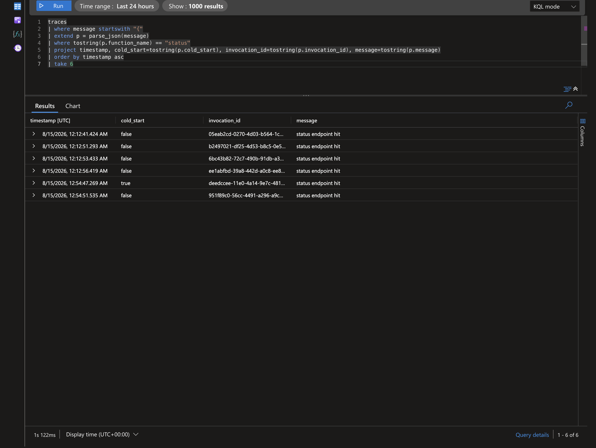

# Example: Cold Start Detection

`azure-functions-logging` automatically flags cold starts through the `cold_start` field when `logging_context(context)` is used.

## Goal

Track first-invocation behavior and build simple metrics patterns from logs.

## How It Works

Cold start logic is process-scoped:

- First call within `logging_context(context)` in a process sets `cold_start=True`.
- Subsequent calls set `cold_start=False`.

No manual counters are required in your code.

## Baseline Azure Function

```python
import azure.functions as func
from azure_functions_logging import JsonFormatter, get_logger, logging_context, setup_logging

setup_logging(functions_formatter=JsonFormatter())
logger = get_logger("cold-start-demo")

app = func.FunctionApp()


@app.route(route="status")
def status(req: func.HttpRequest, context: func.Context) -> func.HttpResponse:
    with logging_context(context):
        logger.info("status endpoint hit")
        return func.HttpResponse("ok")
```

## Expected Event Pattern

After starting a new process:

```json
{"message":"status endpoint hit","cold_start":true,...}
{"message":"status endpoint hit","cold_start":false,...}
{"message":"status endpoint hit","cold_start":false,...}
```

The first invocation after startup is your cold start marker.

## In Application Insights

After deploying and sending a few requests to `/api/status`, query the `traces` table. In this deployment the structured JSON stays inside the `message` column, so we parse it with `parse_json(message)` (see the [deployment query guide](../deployment.md#inspect-traces-and-requests) for the `customDimensions`-parsed variant).

```kql
traces
| where message startswith "{"
| extend p = parse_json(message)
| where tostring(p.function_name) == "status"
| project timestamp, cold_start=tostring(p.cold_start), invocation_id=tostring(p.invocation_id), message=tostring(p.message)
| order by timestamp asc
| take 6
```

Result from a real deployed app — only the first invocation on a fresh worker is flagged `cold_start=true`:



Cold start ratio over the last hour (matches the [metrics pattern](#metrics-pattern-cold-start-ratio) above):

```kql
traces
| where message startswith "{"
| extend p = parse_json(message)
| where timestamp > ago(1h)
| summarize cold = countif(tostring(p.cold_start) == "true"), total = count()
| extend cold_start_ratio = todouble(cold) / total
```

| cold | total | cold_start_ratio |
| --- | --- | --- |
| 3 | 420 | 0.0071 |

> If your pipeline parses the JSON into `customDimensions` instead, drop `parse_json(message)` and read `customDimensions.cold_start` directly.

## Local Verification Steps

1. Start local function host.
2. Send one request and inspect logs.
3. Confirm `cold_start=true` on first event.
4. Send additional requests and confirm `false`.
5. Restart host and repeat.

## Metrics Pattern: Cold Start Ratio

From structured logs:

- Numerator: count of events where `cold_start=true`.
- Denominator: count of invocation-start events.
- Ratio: cold starts / total invocations.

This gives a simple startup pressure signal over time.

## Metrics Pattern: Cold Start Latency Split

Log duration and group by `cold_start`:

```python
import time

start = time.perf_counter()
# ... handler logic ...
elapsed_ms = int((time.perf_counter() - start) * 1000)
logger.info("request completed", duration_ms=elapsed_ms)
```

Then compare p50/p95 duration where:

- `cold_start=true`
- `cold_start=false`

This separates startup cost from warm-path performance.

## Alerting Pattern

Create alert rules for:

- Spike in cold start ratio.
- Elevated error rate when `cold_start=true`.
- Long tail latency concentrated in cold starts.

These rules improve operational clarity during scaling events.

## Combining with Context Binding

```python
request_logger = logger.bind(route="/status", method=req.method)
request_logger.info("request begin")
```

Now each event includes:

- Invocation metadata from `logging_context(context)`.
- Route/request metadata from `bind()`.

## Caveats

- Cold start state is process-local, not global to an app instance fleet.
- Scale-out introduces multiple processes with independent first invocations.
- Restarting host or recycling worker resets the first-call marker.

## Practical Dashboard Dimensions

Use these dimensions together:

- `function_name`
- `cold_start`
- `level`
- `extra.duration_ms`
- `extra.route`

This enables fast drill-down from availability to startup-specific regressions.

## Example Query Intention

Look for events like:

- `message == "request completed"`
- `cold_start == true`
- group by `function_name`

Then compare against warm-path events over same time window.

## Related Examples

- [Context Injection](context_injection.md)
- [Context Binding](context_binding.md)
- [JSON Output](json_output.md)
- [Basic Setup](basic_setup.md)
