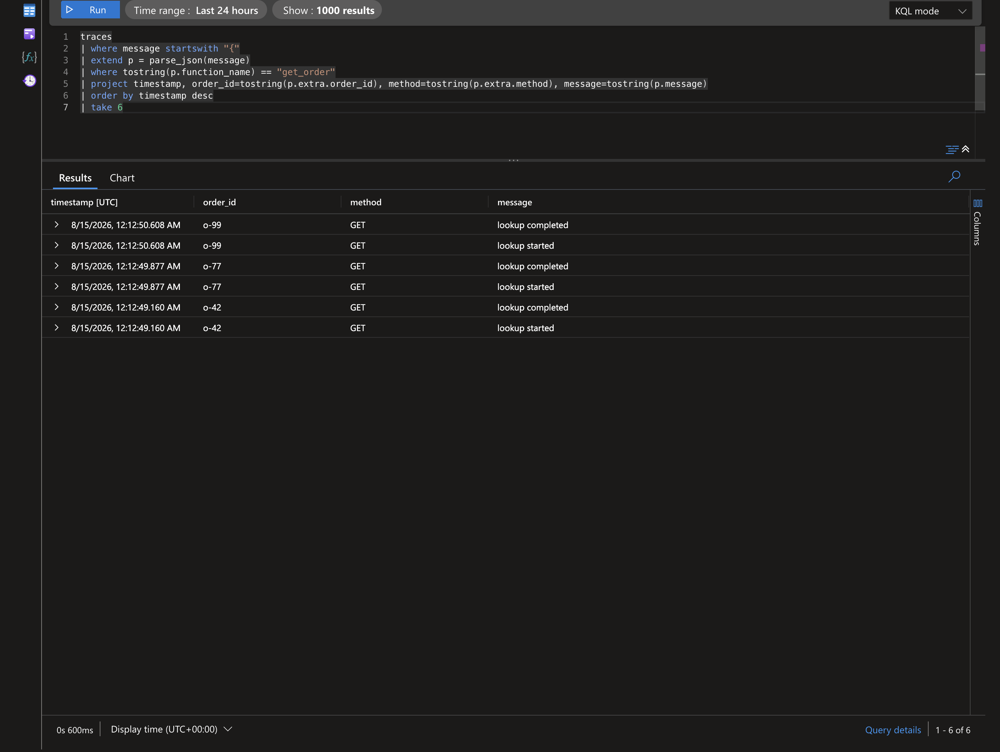

# Example: Context Binding

`FunctionLogger.bind()` attaches persistent key-value context to a logger and returns a new logger instance.

## Goal

Use `bind()` for request-scoped metadata, chain bindings safely, and clear bound context when needed.

## Baseline Pattern

```python
from azure_functions_logging import get_logger, setup_logging

setup_logging(format="json")
logger = get_logger(__name__)

request_logger = logger.bind(request_id="req-1", tenant_id="tenant-a")
request_logger.info("request started")
request_logger.info("request completed")
```

Both log lines include `request_id` and `tenant_id`.

## Immutability Guarantee

`bind()` does not mutate the original logger.

```python
base = get_logger("api")
bound = base.bind(user_id="u-1")

base.info("base")
bound.info("bound")
```

Result:

- `base` events do not include `user_id`.
- `bound` events include `user_id`.

This behavior helps avoid accidental context leaks.

## Chaining Bind Calls

```python
base = get_logger("checkout")
l1 = base.bind(request_id="r-100")
l2 = l1.bind(user_id="u-900")
l3 = l2.bind(cart_id="c-55")

l3.info("checkout started")
```

`l3` contains all merged keys: `request_id`, `user_id`, `cart_id`.

## Clearing Context

Use `clear_context()` on a bound logger to remove accumulated binding on that instance.

```python
bound = logger.bind(user_id="u-1", operation="refund")
bound.info("before clear")

bound.clear_context()
bound.info("after clear")
```

After `clear_context()`, bound fields from that instance are removed.

## Azure Functions Request Pattern

```python
import azure.functions as func
from azure_functions_logging import JsonFormatter, get_logger, logging_context, setup_logging

setup_logging(functions_formatter=JsonFormatter())
logger = get_logger("orders")

app = func.FunctionApp()


@app.route(route="orders/{order_id}")
def get_order(req: func.HttpRequest, context: func.Context) -> func.HttpResponse:
    with logging_context(context):
        order_id = req.route_params.get("order_id")
        request_logger = logger.bind(order_id=order_id, method=req.method)

        request_logger.info("lookup started")
        request_logger.info("lookup completed")
        return func.HttpResponse("ok")
```

This combines:

- Global invocation fields from `logging_context(context)`.
- Per-request keys from `bind()`.

## In Application Insights

After deploying and requesting `/api/orders/o-42`, query the `traces` table. In this deployment the structured JSON stays inside the `message` column, so we parse it with `parse_json(message)` — bound keys land under `extra.*` alongside the injected invocation fields (see the [deployment query guide](../deployment.md#inspect-traces-and-requests) for the `customDimensions`-parsed variant).

```kql
traces
| where message startswith "{"
| extend p = parse_json(message)
| where tostring(p.function_name) == "get_order"
| project timestamp, order_id=tostring(p.extra.order_id), method=tostring(p.extra.method), message=tostring(p.message)
| order by timestamp desc
| take 6
```

Result from a real deployed app — both lifecycle events share the same bound `order_id` / `method`:



The bound `order_id` lets you slice every log for one order in a single query, without threading it through each call.

> If your pipeline parses the JSON into `customDimensions` instead, drop `parse_json(message)` and read `customDimensions.order_id` directly.

## Recommended Binding Dimensions

Good binding keys are stable per request scope:

- `request_id`
- `tenant_id`
- `user_id`
- `operation`
- `route`

Avoid high-cardinality noisy keys unless required for diagnostics.

## Binding vs Per-Call Extra

Use `bind()` when a key should appear on many logs in the same scope.
Use per-call kwargs when data is specific to a single event.

```python
request_logger = logger.bind(request_id="r-1", tenant_id="t-1")
request_logger.info("payment authorized", amount=19.9, currency="USD")
```

## Safety Notes

- Do not keep request-specific bound loggers as global singletons.
- Create bound loggers inside invocation scope.
- Prefer immutable bind chains over mutable shared state.

!!! warning
    Reusing one globally bound logger for unrelated requests can create misleading correlation data.

## Mini End-to-End Flow

```python
def process_checkout(base_logger, request_id, user_id):
    log = base_logger.bind(request_id=request_id, user_id=user_id, operation="checkout")
    log.info("step 1: validate cart")
    log.info("step 2: authorize payment")
    log.info("step 3: create order")
```

All steps share the same contextual dimensions.

## Related Examples

- [Context Injection](context_injection.md)
- [Cold Start Detection](cold_start_detection.md)
- [JSON Output](json_output.md)
- [Basic Setup](basic_setup.md)
