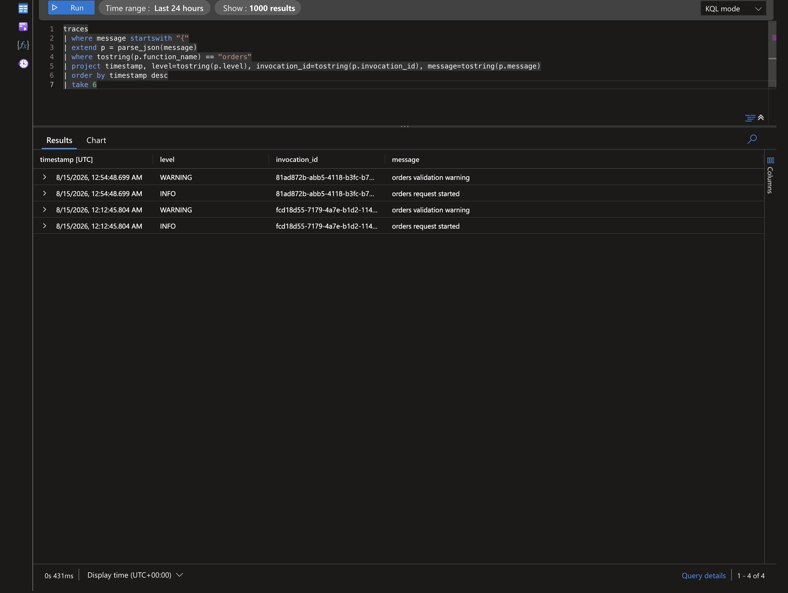

# Example: host.json Conflict Resolution

This example shows how host-level log policy can suppress application logs and how to fix it safely.

## Why This Matters

`setup_logging(level=logging.INFO)` can still appear broken if `host.json` is stricter.

Common symptom:

- `INFO` logs missing in Azure or Core Tools output.
- `WARNING` and above still visible.

## Baseline Application Setup

```python
import logging
from azure_functions_logging import get_logger, setup_logging

setup_logging(level=logging.INFO, format="json")
logger = get_logger(__name__)

logger.info("info event")
logger.warning("warning event")
```

## Conflicting host.json

```json
{
  "logging": {
    "logLevel": {
      "default": "Warning"
    }
  }
}
```

With this host policy:

- `warning` events appear.
- `info` events are suppressed.

## Corrected host.json

```json
{
  "logging": {
    "logLevel": {
      "default": "Information"
    }
  }
}
```

Now both info and warning events are visible.

## Function-Specific Override Pattern

You can keep strict defaults and open specific functions:

```json
{
  "logging": {
    "logLevel": {
      "default": "Warning",
      "Function.OrdersHttp": "Information"
    }
  }
}
```

This is useful when one function needs richer diagnostics.

## End-to-End Function Example

```python
import azure.functions as func
from azure_functions_logging import JsonFormatter, get_logger, logging_context, setup_logging

setup_logging(functions_formatter=JsonFormatter())
logger = get_logger("orders")

app = func.FunctionApp()


@app.route(route="orders")
def orders(req: func.HttpRequest, context: func.Context) -> func.HttpResponse:
    with logging_context(context):
        logger.info("orders request started")
        logger.warning("orders validation warning")
        return func.HttpResponse("ok")
```

If `INFO` does not appear, inspect `host.json` first.

## In Application Insights

`host.json` conflicts are visible as *missing rows*, not error messages. After deploying and requesting `/api/orders`, query the `traces` table by log level. In this deployment the structured JSON stays inside the `message` column, so we parse it with `parse_json(message)` (see the [deployment query guide](../deployment.md#inspect-traces-and-requests) for the `customDimensions`-parsed variant).

```kql
traces
| where message startswith "{"
| extend p = parse_json(message)
| where tostring(p.function_name) == "orders"
| project timestamp, level=tostring(p.level), invocation_id=tostring(p.invocation_id), message=tostring(p.message)
| order by timestamp desc
| take 6
```

With the **corrected** `host.json` (`"default": "Information"`), both the `INFO` and `WARNING` events appear — this is the real deployed result:



With a **conflicting** `host.json` (`"default": "Warning"`), the `INFO` line never reaches Application Insights — only the `WARNING` row is ingested, and the `INFO` row silently disappears from the result above.

The library's startup conflict warning tells you *before* you go hunting for these missing rows.

> If your pipeline parses the JSON into `customDimensions` instead, drop `parse_json(message)` and read `customDimensions.function_name` / `severityLevel` directly.

## Validation Checklist

1. Verify app setup level.
2. Verify host default level.
3. Verify function-specific overrides.
4. Verify deployment uses expected `host.json`.
5. Verify output sink query is not filtering low levels.

## Safety Guidelines

- Avoid globally setting very low host levels in high-volume workloads.
- Prefer per-function overrides when targeted diagnostics are needed.
- Keep JSON logs structured for efficient filtering.

## Troubleshooting Matrix

| App Level | Host Default | INFO Visible? |
| --- | --- | --- |
| INFO | Warning | No |
| INFO | Information | Yes |
| DEBUG | Warning | No |
| WARNING | Warning | Yes |

## Observability Recommendation

Use this pairing for production:

- App setup: `setup_logging(level=logging.INFO, format="json")`
- Host default: `Information`
- Dependency logger overrides: `WARNING`

This keeps signal quality high while preserving troubleshooting depth.

## Related Docs

- [Configuration](../configuration.md)
- [Troubleshooting](../troubleshooting.md)
- [Usage Guide](../usage.md)
