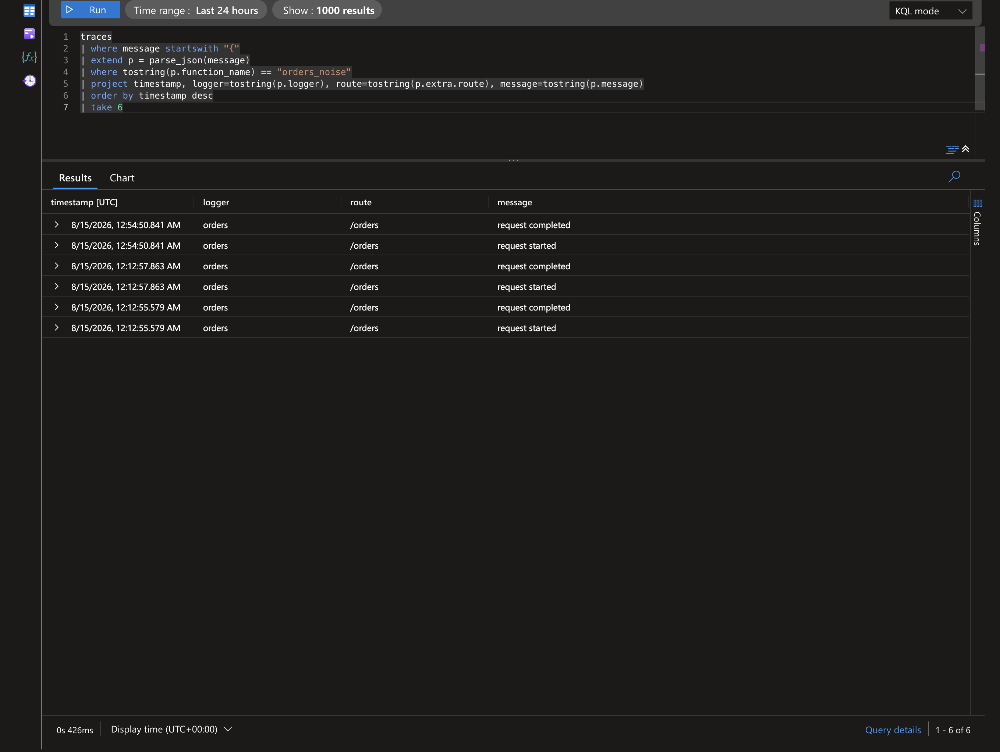

# Example: Third-Party Noise Control

This example shows how to keep application logs clear by reducing noisy dependency logger output.

## Goal

Preserve useful framework and dependency signals while keeping primary operational events easy to find.

## Baseline Setup

```python
import logging
from azure_functions_logging import get_logger, setup_logging

setup_logging(level=logging.INFO, format="json")
logger = get_logger("app")

logger.info("application started")
```

## Add Dependency Level Controls

```python
import logging

logging.getLogger("urllib3").setLevel(logging.WARNING)
logging.getLogger("azure").setLevel(logging.WARNING)
logging.getLogger("azure.core.pipeline.policies.http_logging_policy").setLevel(logging.WARNING)
```

This suppresses low-value dependency info/debug chatter.

## Why It Works

- Python logging is hierarchical.
- Levels can be tuned per logger namespace.
- Your application logger remains at desired visibility level.

## Function Example

```python
import azure.functions as func
from azure_functions_logging import JsonFormatter, get_logger, logging_context, setup_logging

setup_logging(functions_formatter=JsonFormatter())
logger = get_logger("orders")

app = func.FunctionApp()


@app.route(route="orders")
def orders(req: func.HttpRequest, context: func.Context) -> func.HttpResponse:
    with logging_context(context):
        request_logger = logger.bind(route="/orders", method=req.method)
        request_logger.info("request started")
        request_logger.info("request completed")
        return func.HttpResponse("ok")
```

With noise controls, these app events remain visible and query-friendly.

## In Application Insights

Noise control changes *what does not arrive*. After deploying and requesting `/api/orders`, your application events surface cleanly instead of being buried under dependency chatter. In this deployment the structured JSON stays inside the `message` column, so we parse it with `parse_json(message)` (see the [deployment query guide](../deployment.md#inspect-traces-and-requests) for the `customDimensions`-parsed variant).

```kql
traces
| where message startswith "{"
| extend p = parse_json(message)
| where tostring(p.function_name) == "orders_noise"
| project timestamp, logger=tostring(p.logger), route=tostring(p.extra.route), message=tostring(p.message)
| order by timestamp desc
| take 6
```

Result from a real deployed app — clean application lifecycle events, undiluted by `urllib3` / `azure.core` info logs:



To confirm the suppression worked, compare dependency volume before and after tuning:

```kql
traces
| where message startswith "{"
| extend p = parse_json(message)
| where timestamp > ago(1h)
| summarize count() by tostring(p.logger)
| order by count_ desc
```

Suppressed namespaces (`urllib3`, `azure`, `azure.core.pipeline.policies.http_logging_policy`) should drop to warnings-and-above volume, while `orders` keeps full `INFO` visibility.

> If your pipeline parses the JSON into `customDimensions` instead, drop `parse_json(message)` and read `customDimensions.logger` directly.

## Suggested Namespace Policies

| Namespace | Suggested Level | Reason |
| --- | --- | --- |
| `urllib3` | `WARNING` | Reduce connection-level chatter |
| `azure` | `WARNING` | Preserve significant SDK warnings/errors |
| `azure.core.pipeline.policies.http_logging_policy` | `WARNING` | Avoid verbose request/response info |

## Progressive Tuning Strategy

1. Start with dependency namespaces at `WARNING`.
2. Watch for missing diagnostics.
3. Raise specific namespace to `INFO` temporarily during incidents.
4. Revert after investigation.

## Incident Mode Pattern

```python
logging.getLogger("azure").setLevel(logging.INFO)
logger.info("incident mode enabled", reason="sdk investigation")
```

Use for limited time windows to avoid sustained high-volume noise.

## Common Mistakes

- Setting global root to `WARNING`, which hides app info logs.
- Lowering every dependency to `ERROR`, losing valuable warnings.
- Forgetting to document temporary tuning changes.

## Validation Checklist

After configuration:

1. Confirm key app lifecycle logs remain visible.
2. Confirm dependency debug/info chatter is reduced.
3. Confirm warnings/errors from dependencies still surface.
4. Confirm dashboards and alerts still match expected volume.

## Pairing with Binding and Context Injection

Noise control is strongest when combined with structured app logs:

- `with logging_context(context):` for invocation correlation.
- `bind()` for request-level dimensions.
- Namespace level controls for dependency suppression.

This keeps signal density high and triage time low.

## Related Docs

- [Usage Guide](../usage.md)
- [Configuration](../configuration.md)
- [Troubleshooting](../troubleshooting.md)
